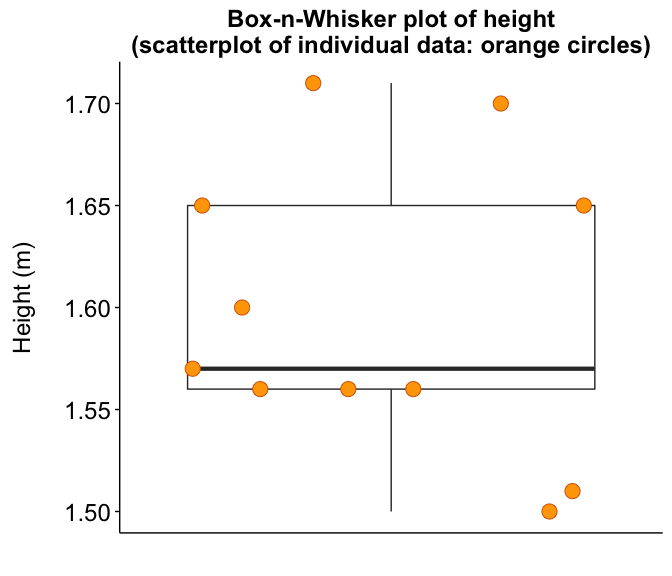
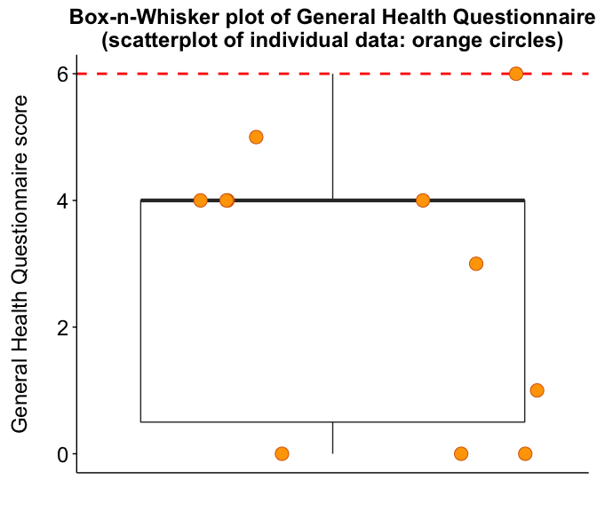

Demographics
============

### Authors: Stella Iacovides & Peter Kamerman

**Date: January 22, 2016**

------------------------------------------------------------------------

Load required packages and set chunk options
--------------------------------------------

``` r
# Load packages
library(knitr)
library(pander)
library(ggplot2)
library(scales)
library(grid)
library(cowplot)
library(readr)
library(dplyr)
library(tidyr)

# knitr chunk options
opts_chunk$set(echo = TRUE,
               warning = FALSE,
               message = FALSE,
               fig.path = './figures/',
               fig.width = 7,
               fig.height = 6,
               dev = c('png', 'pdf'),
               tidy = TRUE, 
               tidy.opts = list(width.cutoff = 65))
```

Load data
---------

``` r
demo <- read_csv("./data/demographics.csv", col_names = T)
```

Quick look
----------

``` r
# dim(data) names(demo) head(demo) tail(demo)
glimpse(demo)
```

    ## Observations: 11
    ## Variables: 12
    ## $ id                 (chr) "A", "B", "C", "D", "E", "F", "G", "H", "I"...
    ## $ age_years          (int) 21, 21, 21, 21, 21, 22, 24, 21, 21, 21, 23
    ## $ weight_kg          (int) 65, 55, 52, 70, 78, 53, 88, 60, 66, 63, 52
    ## $ height_m           (dbl) 1.65, 1.57, 1.56, 1.56, 1.50, 1.56, 1.65, 1...
    ## $ bmi_kg.m           (dbl) 23.8, 22.3, 22.4, 28.7, 34.6, 21.7, 32.3, 2...
    ## $ menstrual.pain_vas (int) 9, 24, 30, 11, 20, 16, 25, 10, 9, 9, 7
    ## $ ghq_score          (int) 0, 5, 6, 4, 4, 0, 4, 1, 0, 4, 3
    ## $ psi_score          (int) 3, 5, 5, 5, 5, 2, 4, 2, 4, 2, 4
    ## $ menarche.age_years (int) 13, 15, 15, 15, 13, 11, 12, 14, 12, 14, 15
    ## $ menstruation_years (int) 8, 6, 6, 6, 8, 11, 12, 7, 9, 7, 8
    ## $ cycle.length_days  (int) 28, 28, 28, 28, 30, 28, 28, 28, 28, 28, 28
    ## $ menses.length_days (int) 5, 4, 5, 5, 5, 6, 5, 5, 5, 5, 4

``` r
summary(demo)
```

    ##       id              age_years       weight_kg        height_m    
    ##  Length:11          Min.   :21.00   Min.   :52.00   Min.   :1.500  
    ##  Class :character   1st Qu.:21.00   1st Qu.:54.00   1st Qu.:1.560  
    ##  Mode  :character   Median :21.00   Median :63.00   Median :1.570  
    ##                     Mean   :21.55   Mean   :63.82   Mean   :1.597  
    ##                     3rd Qu.:21.50   3rd Qu.:68.00   3rd Qu.:1.650  
    ##                     Max.   :24.00   Max.   :88.00   Max.   :1.710  
    ##     bmi_kg.m     menstrual.pain_vas   ghq_score       psi_score    
    ##  Min.   :20.30   Min.   : 7.00      Min.   :0.000   Min.   :2.000  
    ##  1st Qu.:22.00   1st Qu.: 9.00      1st Qu.:0.500   1st Qu.:2.500  
    ##  Median :22.80   Median :11.00      Median :4.000   Median :4.000  
    ##  Mean   :25.15   Mean   :15.45      Mean   :2.818   Mean   :3.727  
    ##  3rd Qu.:27.50   3rd Qu.:22.00      3rd Qu.:4.000   3rd Qu.:5.000  
    ##  Max.   :34.60   Max.   :30.00      Max.   :6.000   Max.   :5.000  
    ##  menarche.age_years menstruation_years cycle.length_days
    ##  Min.   :11.00      Min.   : 6.0       Min.   :28.00    
    ##  1st Qu.:12.50      1st Qu.: 6.5       1st Qu.:28.00    
    ##  Median :14.00      Median : 8.0       Median :28.00    
    ##  Mean   :13.55      Mean   : 8.0       Mean   :28.18    
    ##  3rd Qu.:15.00      3rd Qu.: 8.5       3rd Qu.:28.00    
    ##  Max.   :15.00      Max.   :12.0       Max.   :30.00    
    ##  menses.length_days
    ##  Min.   :4.000     
    ##  1st Qu.:5.000     
    ##  Median :5.000     
    ##  Mean   :4.909     
    ##  3rd Qu.:5.000     
    ##  Max.   :6.000

Summary plots
-------------

### Age

``` r
# table
pander(summary(demo$age_years), caption = "Five-number summary of age (years)")
```

<table>
<caption>Five-number summary of age (years)</caption>
<colgroup>
<col width="9%" />
<col width="13%" />
<col width="12%" />
<col width="9%" />
<col width="13%" />
<col width="8%" />
</colgroup>
<thead>
<tr class="header">
<th align="center">Min.</th>
<th align="center">1st Qu.</th>
<th align="center">Median</th>
<th align="center">Mean</th>
<th align="center">3rd Qu.</th>
<th align="center">Max.</th>
</tr>
</thead>
<tbody>
<tr class="odd">
<td align="center">21</td>
<td align="center">21</td>
<td align="center">21</td>
<td align="center">21.55</td>
<td align="center">21.5</td>
<td align="center">24</td>
</tr>
</tbody>
</table>

``` r
# plot
ggplot(data = demo, aes(x = factor("Participants"), y = age_years)) + 
    geom_boxplot(outlier.size = 3, fatten = 3) + geom_jitter(shape = 21, 
    size = 5, fill = "orange", colour = "#D55E00", position = position_jitter(height = 0)) + 
    labs(title = "Box-n-Whisker plot of age\n(scatterplot of individual data: orange circles)", 
        x = "", y = "Age (years)\n") + theme_cowplot() + theme(axis.ticks.x = element_blank(), 
    axis.text.x = element_blank(), axis.text = element_text(size = 18), 
    axis.title = element_text(size = 18), plot.title = element_text(size = 18))
```


 \#\#\# Weight

``` r
# table
pander(summary(demo$weight_kg), caption = "Five-number summary of weight (kg)")
```

<table>
<caption>Five-number summary of weight (kg)</caption>
<colgroup>
<col width="9%" />
<col width="13%" />
<col width="12%" />
<col width="9%" />
<col width="13%" />
<col width="8%" />
</colgroup>
<thead>
<tr class="header">
<th align="center">Min.</th>
<th align="center">1st Qu.</th>
<th align="center">Median</th>
<th align="center">Mean</th>
<th align="center">3rd Qu.</th>
<th align="center">Max.</th>
</tr>
</thead>
<tbody>
<tr class="odd">
<td align="center">52</td>
<td align="center">54</td>
<td align="center">63</td>
<td align="center">63.82</td>
<td align="center">68</td>
<td align="center">88</td>
</tr>
</tbody>
</table>

``` r
# plot
ggplot(data = demo, aes(x = factor("Participants"), y = weight_kg)) + 
    geom_boxplot(outlier.size = 3, fatten = 3) + geom_jitter(shape = 21, 
    size = 5, fill = "orange", colour = "#D55E00", position = position_jitter(height = 0)) + 
    labs(title = "Box-n-Whisker plot of weight\n(scatterplot of individual data: orange circles)", 
        x = "", y = "Weight (kg)\n") + theme_cowplot() + theme(axis.ticks.x = element_blank(), 
    axis.text.x = element_blank(), axis.text = element_text(size = 18), 
    axis.title = element_text(size = 18), plot.title = element_text(size = 18))
```


 \#\#\# Height

``` r
# table
pander(summary(demo$height_m), caption = "Five-number summary of height (m)")
```

<table>
<caption>Five-number summary of height (m)</caption>
<colgroup>
<col width="9%" />
<col width="13%" />
<col width="12%" />
<col width="9%" />
<col width="13%" />
<col width="8%" />
</colgroup>
<thead>
<tr class="header">
<th align="center">Min.</th>
<th align="center">1st Qu.</th>
<th align="center">Median</th>
<th align="center">Mean</th>
<th align="center">3rd Qu.</th>
<th align="center">Max.</th>
</tr>
</thead>
<tbody>
<tr class="odd">
<td align="center">1.5</td>
<td align="center">1.56</td>
<td align="center">1.57</td>
<td align="center">1.597</td>
<td align="center">1.65</td>
<td align="center">1.71</td>
</tr>
</tbody>
</table>

``` r
# plot
ggplot(data = demo, aes(x = factor("Participants"), y = height_m)) + 
    geom_boxplot(outlier.size = 3, fatten = 3) + geom_jitter(shape = 21, 
    size = 5, fill = "orange", colour = "#D55E00", position = position_jitter(height = 0)) + 
    labs(title = "Box-n-Whisker plot of height\n(scatterplot of individual data: orange circles)", 
        x = "", y = "Height (m)\n") + theme_cowplot() + theme(axis.ticks.x = element_blank(), 
    axis.text.x = element_blank(), axis.text = element_text(size = 18), 
    axis.title = element_text(size = 18), plot.title = element_text(size = 18))
```


 \#\#\# Body mass index (BMI)

``` r
# table
pander(summary(demo$height_m), caption = "Five-number summary of body mass index (BMI; m/kg^2)")
```

<table>
<caption>Five-number summary of body mass index (BMI; m/kg^2)</caption>
<colgroup>
<col width="9%" />
<col width="13%" />
<col width="12%" />
<col width="9%" />
<col width="13%" />
<col width="8%" />
</colgroup>
<thead>
<tr class="header">
<th align="center">Min.</th>
<th align="center">1st Qu.</th>
<th align="center">Median</th>
<th align="center">Mean</th>
<th align="center">3rd Qu.</th>
<th align="center">Max.</th>
</tr>
</thead>
<tbody>
<tr class="odd">
<td align="center">1.5</td>
<td align="center">1.56</td>
<td align="center">1.57</td>
<td align="center">1.597</td>
<td align="center">1.65</td>
<td align="center">1.71</td>
</tr>
</tbody>
</table>

``` r
# plot
ggplot(data = demo, aes(x = factor("Participants"), y = bmi_kg.m)) + 
    geom_boxplot(outlier.size = 3, fatten = 3) + geom_jitter(shape = 21, 
    size = 5, fill = "orange", colour = "#D55E00", position = position_jitter(height = 0)) + 
    labs(title = "Box-n-Whisker plot of body mass index (BMI)\n(scatterplot of individual data: orange circles)", 
        x = "", y = "Body mass index (kg/m^2)\n") + theme_cowplot() + 
    theme(axis.ticks.x = element_blank(), axis.text.x = element_blank(), 
        axis.text = element_text(size = 18), axis.title = element_text(size = 18), 
        plot.title = element_text(size = 18))
```


 \#\#\# Intensity of menstrual pain

``` r
# table
pander(summary(demo$menstrual.pain_vas), caption = "Five-number summary of menstrual pain ratings (0-100mm VAS)")
```

<table>
<caption>Five-number summary of menstrual pain ratings (0-100mm VAS)</caption>
<colgroup>
<col width="9%" />
<col width="13%" />
<col width="12%" />
<col width="9%" />
<col width="13%" />
<col width="8%" />
</colgroup>
<thead>
<tr class="header">
<th align="center">Min.</th>
<th align="center">1st Qu.</th>
<th align="center">Median</th>
<th align="center">Mean</th>
<th align="center">3rd Qu.</th>
<th align="center">Max.</th>
</tr>
</thead>
<tbody>
<tr class="odd">
<td align="center">7</td>
<td align="center">9</td>
<td align="center">11</td>
<td align="center">15.45</td>
<td align="center">22</td>
<td align="center">30</td>
</tr>
</tbody>
</table>

``` r
# plot
ggplot(data = demo, aes(x = factor("Participants"), y = menstrual.pain_vas)) + 
    geom_boxplot(outlier.size = 3, fatten = 3) + geom_jitter(shape = 21, 
    size = 5, fill = "orange", colour = "#D55E00", position = position_jitter(height = 0)) + 
    labs(title = "Box-n-Whisker plot of menstrual pain\n(scatterplot of individual data: orange circles)", 
        x = "", y = "Pain intensity (0-100mm VAS)\n") + theme_cowplot() + 
    theme(axis.ticks.x = element_blank(), axis.text.x = element_blank(), 
        axis.text = element_text(size = 18), axis.title = element_text(size = 18), 
        plot.title = element_text(size = 18))
```


 \#\#\# General Health Questionniare

``` r
# table
pander(summary(demo$ghq_score), caption = "Five-number summary of General Health Questionniare (GHQ) scores")
```

<table>
<caption>Five-number summary of General Health Questionniare (GHQ) scores</caption>
<colgroup>
<col width="9%" />
<col width="13%" />
<col width="12%" />
<col width="9%" />
<col width="13%" />
<col width="8%" />
</colgroup>
<thead>
<tr class="header">
<th align="center">Min.</th>
<th align="center">1st Qu.</th>
<th align="center">Median</th>
<th align="center">Mean</th>
<th align="center">3rd Qu.</th>
<th align="center">Max.</th>
</tr>
</thead>
<tbody>
<tr class="odd">
<td align="center">0</td>
<td align="center">0.5</td>
<td align="center">4</td>
<td align="center">2.818</td>
<td align="center">4</td>
<td align="center">6</td>
</tr>
</tbody>
</table>

``` r
# plot
ggplot(data = demo, aes(x = factor("Participants"), y = ghq_score)) + 
    geom_boxplot(outlier.size = 3, fatten = 3) + geom_hline(yintercept = 6, 
    colour = "red", size = 1, linetype = 2) + geom_jitter(shape = 21, 
    size = 5, fill = "orange", colour = "#D55E00", position = position_jitter(height = 0)) + 
    labs(title = "Box-n-Whisker plot of General Health Questionnaire\n(scatterplot of individual data: orange circles)", 
        x = "", y = "General Health Questionnaire score\n") + theme_cowplot() + 
    theme(axis.ticks.x = element_blank(), axis.text.x = element_blank(), 
        axis.text = element_text(size = 18), axis.title = element_text(size = 18), 
        plot.title = element_text(size = 18))
```


 \#\#\# Pittsburg Sleep Quality Index (PSQI)

``` r
# table
pander(summary(demo$psi_score), caption = "Five-number summary of Pittsburg Sleep Quality Index (PSQI) scores")
```

<table>
<caption>Five-number summary of Pittsburg Sleep Quality Index (PSQI) scores</caption>
<colgroup>
<col width="9%" />
<col width="13%" />
<col width="12%" />
<col width="9%" />
<col width="13%" />
<col width="8%" />
</colgroup>
<thead>
<tr class="header">
<th align="center">Min.</th>
<th align="center">1st Qu.</th>
<th align="center">Median</th>
<th align="center">Mean</th>
<th align="center">3rd Qu.</th>
<th align="center">Max.</th>
</tr>
</thead>
<tbody>
<tr class="odd">
<td align="center">2</td>
<td align="center">2.5</td>
<td align="center">4</td>
<td align="center">3.727</td>
<td align="center">5</td>
<td align="center">5</td>
</tr>
</tbody>
</table>

``` r
# plot
ggplot(data = demo, aes(x = factor("Participants"), y = psi_score)) + 
    geom_boxplot(outlier.size = 3, fatten = 3) + geom_hline(yintercept = 5, 
    colour = "red", size = 1, linetype = 2) + geom_jitter(shape = 21, 
    size = 5, fill = "orange", colour = "#D55E00", position = position_jitter(height = 0)) + 
    labs(title = "Box-n-Whisker plot of Pittsburg Sleep Quality Index\n(scatterplot of individual data: orange circles)", 
        x = "", y = "Pittsburg Sleep Quality Index\n") + theme_cowplot() + 
    theme(axis.ticks.x = element_blank(), axis.text.x = element_blank(), 
        axis.text = element_text(size = 18), axis.title = element_text(size = 18), 
        plot.title = element_text(size = 18))
```


 \#\#\# Age at menarche

``` r
# table
pander(summary(demo$menarche.age_years), caption = "Five-number summary of age at menarche (years)")
```

<table>
<caption>Five-number summary of age at menarche (years)</caption>
<colgroup>
<col width="9%" />
<col width="13%" />
<col width="12%" />
<col width="9%" />
<col width="13%" />
<col width="8%" />
</colgroup>
<thead>
<tr class="header">
<th align="center">Min.</th>
<th align="center">1st Qu.</th>
<th align="center">Median</th>
<th align="center">Mean</th>
<th align="center">3rd Qu.</th>
<th align="center">Max.</th>
</tr>
</thead>
<tbody>
<tr class="odd">
<td align="center">11</td>
<td align="center">12.5</td>
<td align="center">14</td>
<td align="center">13.55</td>
<td align="center">15</td>
<td align="center">15</td>
</tr>
</tbody>
</table>

``` r
# plot
ggplot(data = demo, aes(x = factor("Participants"), y = menarche.age_years)) + 
    geom_boxplot(outlier.size = 3, fatten = 3) + geom_jitter(shape = 21, 
    size = 5, fill = "orange", colour = "#D55E00", position = position_jitter(height = 0)) + 
    labs(title = "Box-n-Whisker plot of age of menarche\n(scatterplot of individual data: orange circles)", 
        x = "", y = "Age of menarche (years)\n") + theme_cowplot() + 
    theme(axis.ticks.x = element_blank(), axis.text.x = element_blank(), 
        axis.text = element_text(size = 18), axis.title = element_text(size = 18), 
        plot.title = element_text(size = 18))
```


 \#\#\# Time since menarche

``` r
# table
pander(summary(demo$menstruation_years), caption = "Five-number summary of time since menarche (years)")
```

<table>
<caption>Five-number summary of time since menarche (years)</caption>
<colgroup>
<col width="9%" />
<col width="13%" />
<col width="12%" />
<col width="9%" />
<col width="13%" />
<col width="8%" />
</colgroup>
<thead>
<tr class="header">
<th align="center">Min.</th>
<th align="center">1st Qu.</th>
<th align="center">Median</th>
<th align="center">Mean</th>
<th align="center">3rd Qu.</th>
<th align="center">Max.</th>
</tr>
</thead>
<tbody>
<tr class="odd">
<td align="center">6</td>
<td align="center">6.5</td>
<td align="center">8</td>
<td align="center">8</td>
<td align="center">8.5</td>
<td align="center">12</td>
</tr>
</tbody>
</table>

``` r
# plot
ggplot(data = demo, aes(x = factor("Participants"), y = menstruation_years)) + 
    geom_boxplot(outlier.size = 3, fatten = 3) + geom_jitter(shape = 21, 
    size = 5, fill = "orange", colour = "#D55E00", position = position_jitter(height = 0)) + 
    labs(title = "Box-n-Whisker plot of time since menarche\n(scatterplot of individual data: orange circles)", 
        x = "", y = "Time since menarche (years)\n") + theme_cowplot() + 
    theme(axis.ticks.x = element_blank(), axis.text.x = element_blank(), 
        axis.text = element_text(size = 18), axis.title = element_text(size = 18), 
        plot.title = element_text(size = 18))
```


 \#\#\# Average menstrual cycle length

``` r
# table
pander(summary(demo$cycle.length_days), caption = "Five-number summary of menstrual cycle length (days)")
```

<table>
<caption>Five-number summary of menstrual cycle length (days)</caption>
<colgroup>
<col width="9%" />
<col width="13%" />
<col width="12%" />
<col width="9%" />
<col width="13%" />
<col width="8%" />
</colgroup>
<thead>
<tr class="header">
<th align="center">Min.</th>
<th align="center">1st Qu.</th>
<th align="center">Median</th>
<th align="center">Mean</th>
<th align="center">3rd Qu.</th>
<th align="center">Max.</th>
</tr>
</thead>
<tbody>
<tr class="odd">
<td align="center">28</td>
<td align="center">28</td>
<td align="center">28</td>
<td align="center">28.18</td>
<td align="center">28</td>
<td align="center">30</td>
</tr>
</tbody>
</table>

``` r
# plot
ggplot(data = demo, aes(x = factor("Participants"), y = cycle.length_days)) + 
    geom_boxplot(outlier.size = 3, fatten = 3) + geom_jitter(shape = 21, 
    size = 5, fill = "orange", colour = "#D55E00", position = position_jitter(height = 0)) + 
    labs(title = "Box-n-Whisker plot of menstrual cycle length\n(scatterplot of individual data: orange circles)", 
        x = "", y = "Length of menstrual cycle (days)\n") + theme_cowplot() + 
    theme(axis.ticks.x = element_blank(), axis.text.x = element_blank(), 
        axis.text = element_text(size = 18), axis.title = element_text(size = 18), 
        plot.title = element_text(size = 18))
```


 \#\#\# Duration of menstrual period

``` r
# table
pander(summary(demo$menses.length_days), caption = "Five-number summary of duration of menstrual period (days)")
```

<table>
<caption>Five-number summary of duration of menstrual period (days)</caption>
<colgroup>
<col width="9%" />
<col width="13%" />
<col width="12%" />
<col width="9%" />
<col width="13%" />
<col width="8%" />
</colgroup>
<thead>
<tr class="header">
<th align="center">Min.</th>
<th align="center">1st Qu.</th>
<th align="center">Median</th>
<th align="center">Mean</th>
<th align="center">3rd Qu.</th>
<th align="center">Max.</th>
</tr>
</thead>
<tbody>
<tr class="odd">
<td align="center">4</td>
<td align="center">5</td>
<td align="center">5</td>
<td align="center">4.909</td>
<td align="center">5</td>
<td align="center">6</td>
</tr>
</tbody>
</table>

``` r
# plot
ggplot(data = demo, aes(x = factor("Participants"), y = menses.length_days)) + 
    geom_boxplot(outlier.size = 3, fatten = 3) + geom_jitter(shape = 21, 
    size = 5, fill = "orange", colour = "#D55E00", position = position_jitter(height = 0)) + 
    labs(title = "Box-n-Whisker plot of duration of menstrual period\n(scatterplot of individual data: orange circles)", 
        x = "", y = "Menstrual period (days)\n") + theme_cowplot() + 
    theme(axis.ticks.x = element_blank(), axis.text.x = element_blank(), 
        axis.text = element_text(size = 18), axis.title = element_text(size = 18), 
        plot.title = element_text(size = 18))
```


 \#\# Session information

``` r
sessionInfo()
```

    ## R version 3.2.3 (2015-12-10)
    ## Platform: x86_64-apple-darwin13.4.0 (64-bit)
    ## Running under: OS X 10.11.3 (El Capitan)
    ## 
    ## locale:
    ## [1] C
    ## 
    ## attached base packages:
    ## [1] grid      stats     graphics  grDevices utils     datasets  methods  
    ## [8] base     
    ## 
    ## other attached packages:
    ## [1] tidyr_0.4.0   dplyr_0.4.3   readr_0.2.2   cowplot_0.6.0 scales_0.3.0 
    ## [6] ggplot2_2.0.0 pander_0.6.0  knitr_1.12   
    ## 
    ## loaded via a namespace (and not attached):
    ##  [1] Rcpp_0.12.3      magrittr_1.5     munsell_0.4.2    colorspace_1.2-6
    ##  [5] R6_2.1.1         stringr_1.0.0    plyr_1.8.3       tools_3.2.3     
    ##  [9] parallel_3.2.3   gtable_0.1.2     DBI_0.3.1        htmltools_0.3   
    ## [13] yaml_2.1.13      digest_0.6.9     assertthat_0.1   formatR_1.2.1   
    ## [17] evaluate_0.8     rmarkdown_0.9.2  labeling_0.3     stringi_1.0-1
