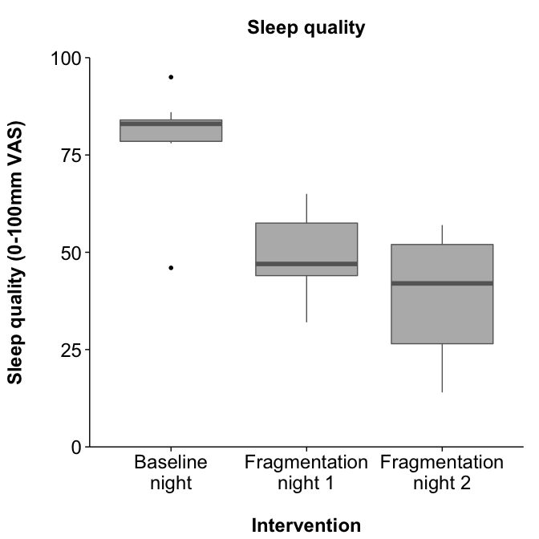
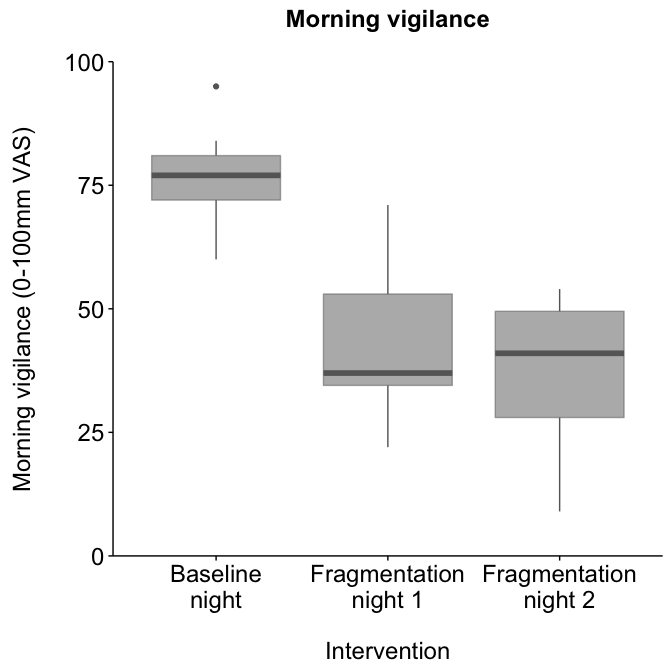
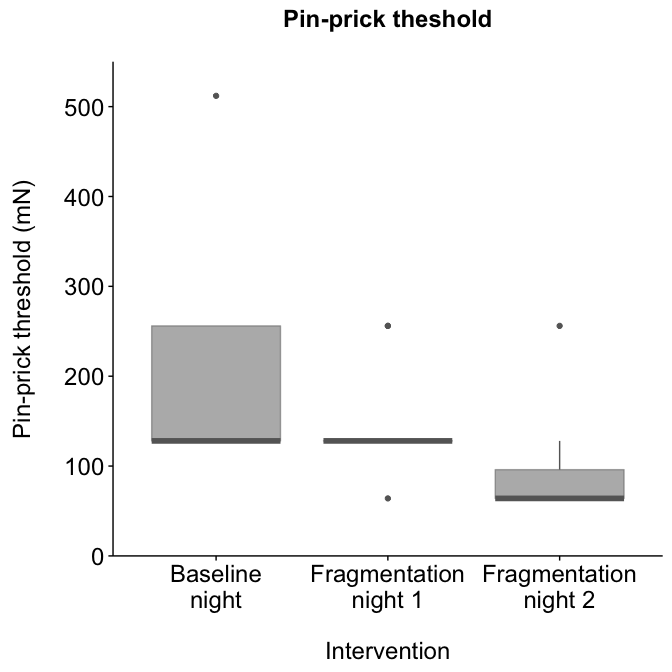
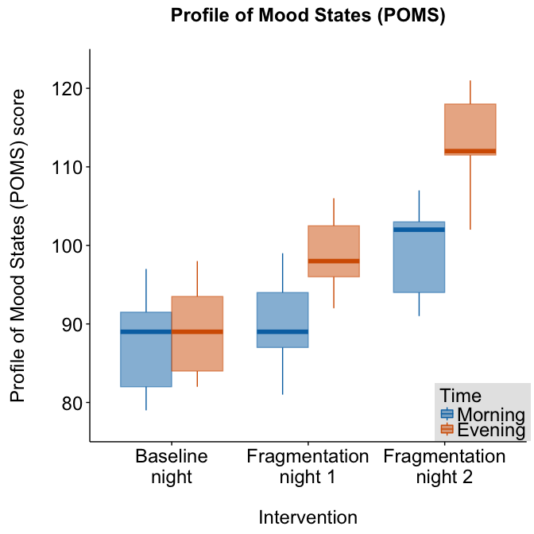
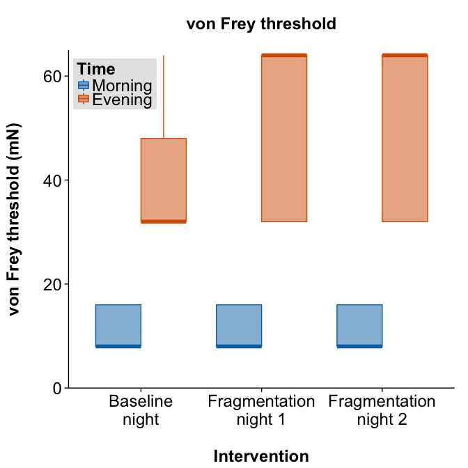

Other effects of sleep fragmentation
====================================

### Authors: Stella Iacovides & Peter Kamerman

**Date: January 26, 2016**

------------------------------------------------------------------------

Load required packages and set chunk options
--------------------------------------------

``` r
# Load packages
library(ggplot2)
library(scales)
library(grid)
library(cowplot)
library(knitr)
library(PMCMR) # Pairwise post-hoc for Friedman test
library(coin) # Alternative Friedman test (used for von Frey)
library(readr)
library(dplyr)
library(tidyr)

# Colour-blind palette
cb.palette <- c("#006BA4", "#C85200", "#595959")


# set seed
set.seed(123)

# knitr chunk options
opts_chunk$set(echo = TRUE,
               warning = FALSE,
               message = FALSE,
               fig.path = './figures/',
               fig.width = 7,
               fig.height = 7,
               dev = c('png', 'pdf'),
               tidy = TRUE, 
               tidy.opts = list(width.cutoff = 65))
```

Load data
---------

``` r
data <- read_csv("./data/other.csv")
```

### Quick look

``` r
# dim(data) names(data) head(data) tail(data)
glimpse(data)
```

    ## Observations: 33
    ## Variables: 9
    ## $ id                (chr) "A", "B", "C", "D", "E", "F", "G", "H", "I",...
    ## $ period            (chr) "baseline", "baseline", "baseline", "baselin...
    ## $ vF.before_mN      (int) 16, 16, 8, 8, 8, 8, 16, 16, 8, 8, 16, 16, 16...
    ## $ vf.during_mN      (int) 32, 64, 32, 32, 32, 32, 64, 32, 64, 32, 32, ...
    ## $ pin.prick_mN      (int) 256, 128, 128, 256, 128, 128, 512, 256, 128,...
    ## $ poms.evening      (int) 91, 85, 79, 97, 92, 89, 81, 94, 83, 81, 89, ...
    ## $ poms.morning      (int) 85, 83, 82, 95, 97, 87, 83, 98, 89, 89, 92, ...
    ## $ sleep.quality     (int) 95, 84, 78, 46, 84, 79, 78, 83, 84, 83, 86, ...
    ## $ morning.vigilance (int) 95, 71, 73, 60, 79, 76, 69, 77, 84, 80, 82, ...

``` r
summary(data)
```

    ##       id               period           vF.before_mN    vf.during_mN  
    ##  Length:33          Length:33          Min.   : 8.00   Min.   :32.00  
    ##  Class :character   Class :character   1st Qu.: 8.00   1st Qu.:32.00  
    ##  Mode  :character   Mode  :character   Median : 8.00   Median :64.00  
    ##                                        Mean   :11.64   Mean   :48.48  
    ##                                        3rd Qu.:16.00   3rd Qu.:64.00  
    ##                                        Max.   :16.00   Max.   :64.00  
    ##   pin.prick_mN    poms.evening     poms.morning   sleep.quality  
    ##  Min.   : 64.0   Min.   : 79.00   Min.   : 82.0   Min.   :14.00  
    ##  1st Qu.: 64.0   1st Qu.: 87.00   1st Qu.: 92.0   1st Qu.:42.00  
    ##  Median :128.0   Median : 93.00   Median : 98.0   Median :52.00  
    ##  Mean   :145.5   Mean   : 92.18   Mean   :100.4   Mean   :56.15  
    ##  3rd Qu.:128.0   3rd Qu.: 97.00   3rd Qu.:111.0   3rd Qu.:78.00  
    ##  Max.   :512.0   Max.   :107.00   Max.   :121.0   Max.   :95.00  
    ##  morning.vigilance
    ##  Min.   : 9.00    
    ##  1st Qu.:36.00    
    ##  Median :52.00    
    ##  Mean   :51.91    
    ##  3rd Qu.:71.00    
    ##  Max.   :95.00

### Process data

``` r
# Convert id and period to factors
data <- data %>% mutate(id = factor(id), period = factor(period))
# Divide data into subsets for analysis Touch sensitivity before
# and after ischaemia
vonfrey <- data %>% select(id, period, vF.before_mN, vf.during_mN)
## Pin-prick sensitivity before ischaemia
pinprick <- data %>% select(id, period, pin.prick_mN)
## Profile of Mood State (POMS) before sleep (poms.evening), and
## after sleep (poms.morning)
poms <- data %>% select(id, period, poms.morning, poms.evening)
## Sleep quality after sleep (0-100mm VAS)
sleep.qual <- data %>% select(id, period, sleep.quality)
## Morning vigilance after sleep (0-100mm VAS)
morning.vig <- data %>% select(id, period, morning.vigilance)
```

Data analysis
-------------

### Sleep quality

``` r
# Plot
ggplot(sleep.qual, aes(x = period, y = sleep.quality, colour = period, 
    fill = period)) + geom_boxplot(fatten = 4, colour = "#666666", 
    fill = "#666666", alpha = 0.5) + labs(x = "\nIntervention", y = "Sleep quality (0-100mm VAS)\n", 
    title = "Sleep quality\n") + scale_y_continuous(limits = c(0, 
    100), expand = c(0, 0)) + scale_x_discrete(labels = c("Baseline\nnight", 
    "Fragmentation\nnight 1", "Fragmentation\nnight 2")) + theme_cowplot() + 
    theme(legend.position = "none", axis.text = element_text(size = 18), 
        axis.title = element_text(size = 18), plot.title = element_text(size = 18))
```



``` r
# Friedman test
friedman.test(sleep.quality ~ period | id, data = sleep.qual)
```

    ## 
    ##  Friedman rank sum test
    ## 
    ## data:  sleep.quality and period and id
    ## Friedman chi-squared = 16.909, df = 2, p-value = 0.0002129

``` r
head(sleep.qual)
```

    ## Source: local data frame [6 x 3]
    ## 
    ##       id   period sleep.quality
    ##   (fctr)   (fctr)         (int)
    ## 1      A baseline            95
    ## 2      B baseline            84
    ## 3      C baseline            78
    ## 4      D baseline            46
    ## 5      E baseline            84
    ## 6      F baseline            79

``` r
# Pairwise posthoc
posthoc.friedman.conover.test(y = sleep.qual$sleep.quality, groups = sleep.qual$period, 
    blocks = sleep.qual$id, p.adjust.method = "holm")
```

    ## 
    ##  Pairwise comparisons using Conover's test for a two-way 
    ##                     balanced complete block design 
    ## 
    ## data:  sleep.qual$sleep.quality , sleep.qual$period and sleep.qual$id 
    ## 
    ##                baseline fragmentation1
    ## fragmentation1 4.8e-08  -             
    ## fragmentation2 3.5e-09  0.092         
    ## 
    ## P value adjustment method: holm

### Morning vigilance

``` r
# Plot
ggplot(morning.vig, aes(x = period, y = morning.vigilance, colour = period, 
    fill = period)) + geom_boxplot(fatten = 4, colour = "#666666", 
    fill = "#666666", alpha = 0.5) + labs(x = "\nIntervention", y = "Morning vigilance (0-100mm VAS)\n", 
    title = "Morning vigilance\n") + scale_y_continuous(limits = c(0, 
    100), expand = c(0, 0)) + scale_x_discrete(labels = c("Baseline\nnight", 
    "Fragmentation\nnight 1", "Fragmentation\nnight 2")) + theme_cowplot() + 
    theme(legend.position = "none", axis.text = element_text(size = 18), 
        axis.title = element_text(size = 18), plot.title = element_text(size = 18))
```



``` r
# Friedman test
friedman.test(morning.vigilance ~ period | id, data = morning.vig)
```

    ## 
    ##  Friedman rank sum test
    ## 
    ## data:  morning.vigilance and period and id
    ## Friedman chi-squared = 17.636, df = 2, p-value = 0.000148

``` r
# Pairwise posthoc
posthoc.friedman.conover.test(y = morning.vig$morning.vigilance, groups = morning.vig$period, 
    blocks = morning.vig$id, p.adjust.method = "holm")
```

    ## 
    ##  Pairwise comparisons using Conover's test for a two-way 
    ##                     balanced complete block design 
    ## 
    ## data:  morning.vig$morning.vigilance , morning.vig$period and morning.vig$id 
    ## 
    ##                baseline fragmentation1
    ## fragmentation1 9.2e-08  -             
    ## fragmentation2 8.4e-10  0.0066        
    ## 
    ## P value adjustment method: holm

### Pin-prick

``` r
# Plot
ggplot(pinprick, aes(x = period, y = pin.prick_mN, colour = period, 
    fill = period)) + geom_boxplot(fatten = 4, colour = "#666666", 
    fill = "#666666", alpha = 0.5) + labs(x = "\nIntervention", y = "Pin-prick threshold (mN)\n", 
    title = "Pin-prick theshold\n") + scale_y_continuous(limits = c(0, 
    550), expand = c(0, 0)) + scale_x_discrete(labels = c("Baseline\nnight", 
    "Fragmentation\nnight 1", "Fragmentation\nnight 2")) + theme_cowplot() + 
    theme(legend.position = "none", axis.text = element_text(size = 18), 
        axis.title = element_text(size = 18), plot.title = element_text(size = 18))
```



``` r
# Friedman test
friedman.test(pin.prick_mN ~ period | id, data = pinprick)
```

    ## 
    ##  Friedman rank sum test
    ## 
    ## data:  pin.prick_mN and period and id
    ## Friedman chi-squared = 17.706, df = 2, p-value = 0.000143

``` r
# Pairwise posthoc
posthoc.friedman.conover.test(y = pinprick$pin.prick_mN, groups = pinprick$period, 
    blocks = pinprick$id, p.adjust.method = "holm")
```

    ## 
    ##  Pairwise comparisons using Conover's test for a two-way 
    ##                     balanced complete block design 
    ## 
    ## data:  pinprick$pin.prick_mN , pinprick$period and pinprick$id 
    ## 
    ##                baseline fragmentation1
    ## fragmentation1 0.0011   -             
    ## fragmentation2 5.8e-10  2.5e-07       
    ## 
    ## P value adjustment method: holm

### Profile of Mood States

``` r
# Plot
poms_plot <- poms %>% group_by(id, period) %>% gather(key = time, 
    value = score, poms.morning, poms.evening)

ggplot(poms_plot, aes(x = period, y = score, colour = time, fill = time)) + 
    geom_boxplot(fatten = 4, alpha = 0.5) + labs(x = "\nIntervention", 
    y = "Profile of Mood States (POMS) score\n", title = "Profile of Mood States (POMS)\n") + 
    scale_y_continuous(limits = c(75, 125), expand = c(0, 0)) + scale_x_discrete(labels = c("Baseline\nnight", 
    "Fragmentation\nnight 1", "Fragmentation\nnight 2")) + scale_fill_manual(name = "Time", 
    labels = c("Evening", "Morning"), values = cb.palette) + scale_colour_manual(name = "Time", 
    labels = c("Evening", "Morning"), values = cb.palette) + theme_cowplot() + 
    theme(legend.position = c(0.9, 0.075), legend.text = element_text(size = 18), 
        legend.title = element_text(size = 18), legend.background = element_rect(fill = "gray90"), 
        axis.text = element_text(size = 18), axis.title = element_text(size = 18), 
        plot.title = element_text(size = 18))
```



``` r
# Friedman test - Evening
friedman.test(poms.evening ~ period | id, data = poms)
```

    ## 
    ##  Friedman rank sum test
    ## 
    ## data:  poms.evening and period and id
    ## Friedman chi-squared = 15.273, df = 2, p-value = 0.0004826

``` r
# Pairwise posthoc - Evening
posthoc.friedman.conover.test(y = poms$poms.evening, groups = poms$period, 
    blocks = poms$id, p.adjust.method = "holm")
```

    ## 
    ##  Pairwise comparisons using Conover's test for a two-way 
    ##                     balanced complete block design 
    ## 
    ## data:  poms$poms.evening , poms$period and poms$id 
    ## 
    ##                baseline fragmentation1
    ## fragmentation1 0.0033   -             
    ## fragmentation2 9.5e-09  3.4e-06       
    ## 
    ## P value adjustment method: holm

``` r
# Friedman test - Morning
friedman.test(poms.morning ~ period | id, data = poms)
```

    ## 
    ##  Friedman rank sum test
    ## 
    ## data:  poms.morning and period and id
    ## Friedman chi-squared = 22, df = 2, p-value = 1.67e-05

``` r
# Pairwise posthoc - Morning
posthoc.friedman.conover.test(y = poms$poms.morning, groups = poms$period, 
    blocks = poms$id, p.adjust.method = "holm")
```

    ## 
    ##  Pairwise comparisons using Conover's test for a two-way 
    ##                     balanced complete block design 
    ## 
    ## data:  poms$poms.morning , poms$period and poms$id 
    ## 
    ##                baseline fragmentation1
    ## fragmentation1 1.3e-07  -             
    ## fragmentation2 1.1e-12  1.3e-07       
    ## 
    ## P value adjustment method: holm

### von Frey

``` r
# von Frey was performed to assess whether fragmentation affected
# touch sensitivity, and to confirm whether the tourniquet indiced
# hypoaesthesia.

# Plot
vf_plot <- vonfrey %>% group_by(id, period) %>% gather(key = time, 
    value = score, vF.before_mN, vf.during_mN)

ggplot(vf_plot, aes(x = period, y = score, colour = time, fill = time)) + 
    geom_boxplot(fatten = 4, alpha = 0.5) + labs(x = "\nIntervention", 
    y = "von Frey threshold (mN)\n", title = "von Frey threshold\n") + 
    scale_y_continuous(limits = c(0, 65), expand = c(0, 0)) + scale_x_discrete(labels = c("Baseline\nnight", 
    "Fragmentation\nnight 1", "Fragmentation\nnight 2")) + scale_fill_manual(name = "Time", 
    labels = c("Evening", "Morning"), values = cb.palette) + scale_colour_manual(name = "Time", 
    labels = c("Evening", "Morning"), values = cb.palette) + theme_cowplot() + 
    theme(legend.position = c(0.12, 0.9), legend.text = element_text(size = 18), 
        legend.title = element_text(size = 18), legend.background = element_rect(fill = "gray90"), 
        axis.text = element_text(size = 18), axis.title = element_text(size = 18), 
        plot.title = element_text(size = 18))
```



``` r
# Friedman test - Before ischaemia
friedman_test(vF.before_mN ~ period | id, data = vonfrey, distribution = approximate(B = 10000))
```

    ## 
    ##  Approximative Friedman Test
    ## 
    ## data:  vF.before_mN by
    ##   period (baseline, fragmentation1, fragmentation2) 
    ##   stratified by id
    ## chi-squared = 0, p-value = 1

``` r
# Friedman test - Before vs during ischaemia Baseline
vf_base <- vf_plot %>% ungroup() %>% filter(period == "baseline") %>% 
    mutate(period = factor(period), time = factor(time))
vf_base_F <- friedman.test(score ~ time | id, data = vf_base)
vf_base_F
```

    ## 
    ##  Friedman rank sum test
    ## 
    ## data:  score and time and id
    ## Friedman chi-squared = 11, df = 1, p-value = 0.0009111

``` r
## Fragmentation night 1
vf_frag1 <- vf_plot %>% ungroup() %>% filter(period == "fragmentation1") %>% 
    mutate(period = factor(period), time = factor(time))
vf_frag1_F <- friedman.test(score ~ time | id, data = vf_frag1)
vf_frag1_F
```

    ## 
    ##  Friedman rank sum test
    ## 
    ## data:  score and time and id
    ## Friedman chi-squared = 11, df = 1, p-value = 0.0009111

``` r
## Fragmentation night 2
vf_frag2 <- vf_plot %>% ungroup() %>% filter(period == "fragmentation2") %>% 
    mutate(period = factor(period), time = factor(time))
vf_frag2_F <- friedman.test(score ~ time | id, data = vf_frag2)
vf_frag2_F
```

    ## 
    ##  Friedman rank sum test
    ## 
    ## data:  score and time and id
    ## Friedman chi-squared = 11, df = 1, p-value = 0.0009111

``` r
## Holm correction
vf_holm <- c(vf_base_F$p.value, vf_frag1_F$p.value, vf_frag2_F$p.value)
matrix(round(p.adjust(vf_holm, method = "holm"), 5), ncol = 3, nrow = 1, 
    dimnames = list(c("p-value"), c("baseline", "fragmentation 1", 
        "fragmentation 2")))
```

    ##         baseline fragmentation 1 fragmentation 2
    ## p-value  0.00273         0.00273         0.00273

Session information
-------------------

``` r
sessionInfo()
```

    ## R version 3.2.3 (2015-12-10)
    ## Platform: x86_64-apple-darwin13.4.0 (64-bit)
    ## Running under: OS X 10.11.3 (El Capitan)
    ## 
    ## locale:
    ## [1] C
    ## 
    ## attached base packages:
    ## [1] grid      stats     graphics  grDevices utils     datasets  methods  
    ## [8] base     
    ## 
    ## other attached packages:
    ##  [1] tidyr_0.4.0     dplyr_0.4.3     readr_0.2.2     coin_1.1-2     
    ##  [5] survival_2.38-3 PMCMR_4.1       knitr_1.12      cowplot_0.6.0  
    ##  [9] scales_0.3.0    ggplot2_2.0.0  
    ## 
    ## loaded via a namespace (and not attached):
    ##  [1] Rcpp_0.12.3       formatR_1.2.1     plyr_1.8.3       
    ##  [4] tools_3.2.3       digest_0.6.9      evaluate_0.8     
    ##  [7] gtable_0.1.2      lattice_0.20-33   DBI_0.3.1        
    ## [10] yaml_2.1.13       parallel_3.2.3    mvtnorm_1.0-3    
    ## [13] stringr_1.0.0     stats4_3.2.3      R6_2.1.1         
    ## [16] rmarkdown_0.9.2   multcomp_1.4-2    TH.data_1.0-6    
    ## [19] magrittr_1.5      codetools_0.2-14  htmltools_0.3    
    ## [22] modeltools_0.2-21 splines_3.2.3     assertthat_0.1   
    ## [25] colorspace_1.2-6  labeling_0.3      sandwich_2.3-4   
    ## [28] stringi_1.0-1     lazyeval_0.1.10   munsell_0.4.2    
    ## [31] zoo_1.7-12
