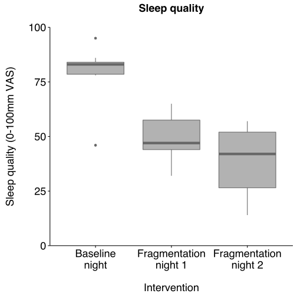
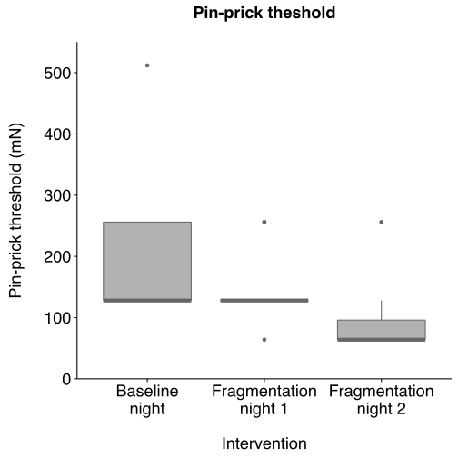
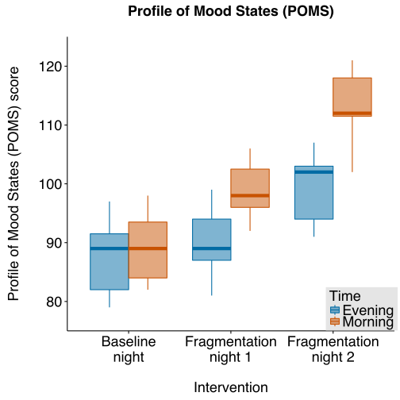
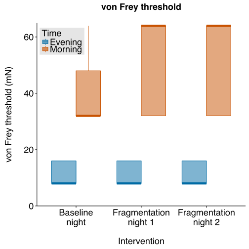
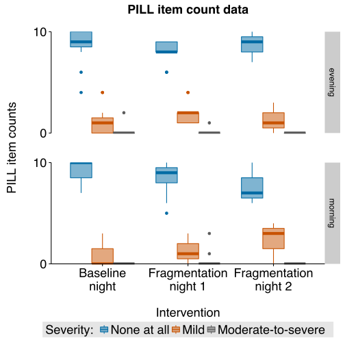

Other effects of sleep fragmentation
====================================

### Authors:

Peter Kamerman, Fiona Baker, and Stella Iacovides

### Date of last 'knit'

June 19, 2016

------------------------------------------------------------------------

Load required packages and set chunk options
--------------------------------------------

Load data
---------

``` r
data <- read_csv('./data/other.csv')
# PILL data as number (count) of questionniare items rated as 
# mild or moderate-to-severe
data_pill <- read_csv('./data/pill-data.csv') 
```

### Quick look

``` r
# dim(data)
# names(data)
# head(data)
# tail(data)
glimpse(data)
```

    ## Observations: 33
    ## Variables: 11
    ## $ id                (chr) "A", "B", "C", "D", "E", "F", "G", "H", "I",...
    ## $ period            (chr) "baseline", "baseline", "baseline", "baselin...
    ## $ vF.before_mN      (int) 16, 16, 8, 8, 8, 8, 16, 16, 8, 8, 16, 16, 16...
    ## $ vf.during_mN      (int) 32, 64, 32, 32, 32, 32, 64, 32, 64, 32, 32, ...
    ## $ pin.prick_mN      (int) 256, 128, 128, 256, 128, 128, 512, 256, 128,...
    ## $ poms.evening      (int) 91, 85, 79, 97, 92, 89, 81, 94, 83, 81, 89, ...
    ## $ poms.morning      (int) 85, 83, 82, 95, 97, 87, 83, 98, 89, 89, 92, ...
    ## $ pill.evening      (int) 0, 0, 0, 1, 0, 0, 0, 0, 0, 0, 0, 0, 0, 0, 2,...
    ## $ pill.morning      (int) 0, 0, 0, 3, 0, 0, 0, 0, 0, 1, 0, 0, 0, 0, 1,...
    ## $ sleep.quality     (int) 95, 84, 78, 46, 84, 79, 78, 83, 84, 83, 86, ...
    ## $ morning.vigilance (int) 95, 71, 73, 60, 79, 76, 69, 77, 84, 80, 82, ...

``` r
summary(data)
```

    ##       id               period           vF.before_mN    vf.during_mN  
    ##  Length:33          Length:33          Min.   : 8.00   Min.   :32.00  
    ##  Class :character   Class :character   1st Qu.: 8.00   1st Qu.:32.00  
    ##  Mode  :character   Mode  :character   Median : 8.00   Median :64.00  
    ##                                        Mean   :11.64   Mean   :48.48  
    ##                                        3rd Qu.:16.00   3rd Qu.:64.00  
    ##                                        Max.   :16.00   Max.   :64.00  
    ##   pin.prick_mN    poms.evening     poms.morning    pill.evening   
    ##  Min.   : 64.0   Min.   : 79.00   Min.   : 82.0   Min.   :0.0000  
    ##  1st Qu.: 64.0   1st Qu.: 87.00   1st Qu.: 92.0   1st Qu.:0.0000  
    ##  Median :128.0   Median : 93.00   Median : 98.0   Median :0.0000  
    ##  Mean   :145.5   Mean   : 92.18   Mean   :100.4   Mean   :0.4242  
    ##  3rd Qu.:128.0   3rd Qu.: 97.00   3rd Qu.:111.0   3rd Qu.:0.0000  
    ##  Max.   :512.0   Max.   :107.00   Max.   :121.0   Max.   :3.0000  
    ##   pill.morning    sleep.quality   morning.vigilance
    ##  Min.   :0.0000   Min.   :14.00   Min.   : 9.00    
    ##  1st Qu.:0.0000   1st Qu.:42.00   1st Qu.:36.00    
    ##  Median :0.0000   Median :52.00   Median :52.00    
    ##  Mean   :0.1818   Mean   :56.15   Mean   :51.91    
    ##  3rd Qu.:0.0000   3rd Qu.:78.00   3rd Qu.:71.00    
    ##  Max.   :3.0000   Max.   :95.00   Max.   :95.00

### Process data

``` r
# Convert id and period to factors
data <- data %>%
    mutate(id = factor(id), 
           period = factor(period))
# Divide data into subsets for analysis
## Touch sensitivity before and after ischaemia
vonfrey <- data %>%
    select(id, period, vF.before_mN, vf.during_mN)
## Pin-prick sensitivity before ischaemia
pinprick <- data %>%
    select(id, period, pin.prick_mN)
## Profile of Mood State (POMS) before sleep (poms.evening), and after sleep (poms.morning)
poms <- data %>%
    select(id, period, poms.morning, poms.evening)
## Sleep quality after sleep (0-100mm VAS)
sleep.qual <- data %>%
    select(id, period, sleep.quality)
## Morning vigilance after sleep (0-100mm VAS)
morning.vig <- data %>%
    select(id, period, morning.vigilance)
```

Data analysis
-------------

### Sleep quality

``` r
# Plot
ggplot(sleep.qual, 
       aes(x = period,
           y = sleep.quality,
           colour = period,
           fill = period)) +
    geom_boxplot(fatten = 4,
                 colour = '#666666',
                 fill = '#666666',
                 alpha = 0.5) +
    labs(x = '\nIntervention',
         y = 'Sleep quality (0-100mm VAS)\n',
         title = 'Sleep quality\n') +
    scale_y_continuous(limits = c(0, 100), expand = c(0,0)) +
    scale_x_discrete(labels = c('Baseline\nnight', 
                                'Fragmentation\nnight 1',
                                'Fragmentation\nnight 2')) +
    theme_cowplot() +
    theme(legend.position = 'none',
          axis.text = element_text(size = 18),
          axis.title = element_text(size = 18),
          plot.title = element_text(size = 18))
```



``` r
# Friedman test
friedman_test(sleep.quality ~ period | id, data = sleep.qual)
```

    ## 
    ##  Asymptotic Friedman Test
    ## 
    ## data:  sleep.quality by
    ##   period (baseline, fragmentation1, fragmentation2) 
    ##   stratified by id
    ## chi-squared = 16.909, df = 2, p-value = 0.0002129

``` r
head(sleep.qual)
```

    ## Source: local data frame [6 x 3]
    ## 
    ##       id   period sleep.quality
    ##   (fctr)   (fctr)         (int)
    ## 1      A baseline            95
    ## 2      B baseline            84
    ## 3      C baseline            78
    ## 4      D baseline            46
    ## 5      E baseline            84
    ## 6      F baseline            79

``` r
# Pairwise posthoc 
posthoc.friedman.conover.test(y = sleep.qual$sleep.quality, 
                              groups = sleep.qual$period, 
                              blocks = sleep.qual$id, 
                              p.adjust.method = 'holm')
```

    ## 
    ##  Pairwise comparisons using Conover's test for a two-way 
    ##                     balanced complete block design 
    ## 
    ## data:  sleep.qual$sleep.quality , sleep.qual$period and sleep.qual$id 
    ## 
    ##                baseline fragmentation1
    ## fragmentation1 4.8e-08  -             
    ## fragmentation2 3.5e-09  0.092         
    ## 
    ## P value adjustment method: holm

### Morning vigilance

``` r
# Plot
ggplot(morning.vig, 
       aes(x = period,
           y = morning.vigilance,
           colour = period,
           fill = period)) +
    geom_boxplot(fatten = 4,
                 colour = '#666666',
                 fill = '#666666',
                 alpha = 0.5) +
    labs(x = '\nIntervention',
         y = 'Morning vigilance (0-100mm VAS)\n',
         title = 'Morning vigilance\n') +
    scale_y_continuous(limits = c(0, 100), expand = c(0,0)) +
    scale_x_discrete(labels = c('Baseline\nnight', 
                                'Fragmentation\nnight 1',
                                'Fragmentation\nnight 2')) +
    theme_cowplot() +
    theme(legend.position = 'none',
          axis.text = element_text(size = 18),
          axis.title = element_text(size = 18),
          plot.title = element_text(size = 18))
```


``` r
# Friedman test
friedman_test(morning.vigilance ~ period | id, data = morning.vig)
```

    ## 
    ##  Asymptotic Friedman Test
    ## 
    ## data:  morning.vigilance by
    ##   period (baseline, fragmentation1, fragmentation2) 
    ##   stratified by id
    ## chi-squared = 17.636, df = 2, p-value = 0.000148

``` r
# Pairwise posthoc 
posthoc.friedman.conover.test(y = morning.vig$morning.vigilance,
                              groups = morning.vig$period,
                              blocks = morning.vig$id, 
                              p.adjust.method = 'holm')
```

    ## 
    ##  Pairwise comparisons using Conover's test for a two-way 
    ##                     balanced complete block design 
    ## 
    ## data:  morning.vig$morning.vigilance , morning.vig$period and morning.vig$id 
    ## 
    ##                baseline fragmentation1
    ## fragmentation1 9.2e-08  -             
    ## fragmentation2 8.4e-10  0.0066        
    ## 
    ## P value adjustment method: holm

### Pin-prick

``` r
# Plot
ggplot(pinprick, 
       aes(x = period,
           y = pin.prick_mN,
           colour = period,
           fill = period)) +
    geom_boxplot(fatten = 4,
                 colour = '#666666',
                 fill = '#666666',
                 alpha = 0.5) +
    labs(x = '\nIntervention',
         y = 'Pin-prick threshold (mN)\n',
         title = 'Pin-prick theshold\n') +
    scale_y_continuous(limits = c(0, 550), expand = c(0,0)) +
    scale_x_discrete(labels = c('Baseline\nnight', 
                                'Fragmentation\nnight 1',
                                'Fragmentation\nnight 2')) +
    theme_cowplot() +
    theme(legend.position = 'none',
          axis.text = element_text(size = 18),
          axis.title = element_text(size = 18),
          plot.title = element_text(size = 18))
```



``` r
# Friedman test
friedman_test(pin.prick_mN ~ period | id, data = pinprick)
```

    ## 
    ##  Asymptotic Friedman Test
    ## 
    ## data:  pin.prick_mN by
    ##   period (baseline, fragmentation1, fragmentation2) 
    ##   stratified by id
    ## chi-squared = 17.706, df = 2, p-value = 0.000143

``` r
# Pairwise posthoc 
posthoc.friedman.conover.test(y = pinprick$pin.prick_mN,
                              groups = pinprick$period,
                              blocks = pinprick$id, 
                              p.adjust.method = 'holm')
```

    ## 
    ##  Pairwise comparisons using Conover's test for a two-way 
    ##                     balanced complete block design 
    ## 
    ## data:  pinprick$pin.prick_mN , pinprick$period and pinprick$id 
    ## 
    ##                baseline fragmentation1
    ## fragmentation1 0.0011   -             
    ## fragmentation2 5.8e-10  2.5e-07       
    ## 
    ## P value adjustment method: holm

### Profile of Mood States

``` r
# Plot
poms_plot <- poms %>%
    group_by(id, period) %>%
    gather(key = time, 
           value = score, 
           poms.morning, 
           poms.evening)

ggplot(poms_plot, 
       aes(x = period,
           y = score,
           colour = time,
           fill = time)) +
    geom_boxplot(fatten = 4, alpha = 0.5) +
    labs(x = '\nIntervention',
         y = 'Profile of Mood States (POMS) score\n',
         title = 'Profile of Mood States (POMS)\n') +
    scale_y_continuous(limits = c(75, 125), 
                       expand = c(0,0)) +
    scale_x_discrete(labels = c('Baseline\nnight', 
                                'Fragmentation\nnight 1',
                                'Fragmentation\nnight 2')) +
    scale_fill_manual(name = 'Time',
                      labels = c('Evening', 'Morning'),
                      values = cb.palette) +
    scale_colour_manual(name = 'Time',
                      labels = c('Evening', 'Morning'),
                      values = cb.palette) +
    theme_cowplot() +
    theme(legend.position = c(0.9, 0.075),
          legend.text = element_text(size = 18),
          legend.title = element_text(size = 18),
          legend.background = element_rect(fill = 'gray90'),
          axis.text = element_text(size = 18),
          axis.title = element_text(size = 18),
          plot.title = element_text(size = 18))
```



``` r
# Friedman test - Evening
friedman_test(poms.evening ~ period | id, data = poms)
```

    ## 
    ##  Asymptotic Friedman Test
    ## 
    ## data:  poms.evening by
    ##   period (baseline, fragmentation1, fragmentation2) 
    ##   stratified by id
    ## chi-squared = 15.273, df = 2, p-value = 0.0004826

``` r
# Pairwise posthoc - Evening
posthoc.friedman.conover.test(y = poms$poms.evening,
                              groups = poms$period,
                              blocks = poms$id,
                              p.adjust.method = 'holm')
```

    ## 
    ##  Pairwise comparisons using Conover's test for a two-way 
    ##                     balanced complete block design 
    ## 
    ## data:  poms$poms.evening , poms$period and poms$id 
    ## 
    ##                baseline fragmentation1
    ## fragmentation1 0.0033   -             
    ## fragmentation2 9.5e-09  3.4e-06       
    ## 
    ## P value adjustment method: holm

``` r
# Friedman test - Morning
friedman_test(poms.morning ~ period | id, data = poms)
```

    ## 
    ##  Asymptotic Friedman Test
    ## 
    ## data:  poms.morning by
    ##   period (baseline, fragmentation1, fragmentation2) 
    ##   stratified by id
    ## chi-squared = 22, df = 2, p-value = 1.67e-05

``` r
# Pairwise posthoc - Morning
posthoc.friedman.conover.test(y = poms$poms.morning,
                              groups = poms$period,
                              blocks = poms$id,
                              p.adjust.method = 'holm')
```

    ## 
    ##  Pairwise comparisons using Conover's test for a two-way 
    ##                     balanced complete block design 
    ## 
    ## data:  poms$poms.morning , poms$period and poms$id 
    ## 
    ##                baseline fragmentation1
    ## fragmentation1 1.3e-07  -             
    ## fragmentation2 1.1e-12  1.3e-07       
    ## 
    ## P value adjustment method: holm

### von Frey

``` r
# von Frey was performed to assess whether fragmentation affected touch sensitivity,
# and to confirm whether the tourniquet indiced hypoaesthesia.

# Plot
vf_plot <- vonfrey %>%
    group_by(id, period) %>%
    gather(key = time,
           value = score, 
           vF.before_mN, 
           vf.during_mN)

ggplot(vf_plot, 
       aes(x = period,
           y = score,
           colour = time,
           fill = time)) +
    geom_boxplot(fatten = 4, alpha = 0.5) +
    labs(x = '\nIntervention',
         y = 'von Frey threshold (mN)\n',
         title = 'von Frey threshold\n') +
    scale_y_continuous(limits = c(0, 65), 
                       expand = c(0,0)) +
    scale_x_discrete(labels = c('Baseline\nnight', 
                                'Fragmentation\nnight 1',
                                'Fragmentation\nnight 2')) +
    scale_fill_manual(name = 'Time',
                      labels = c('Evening', 'Morning'),
                      values = cb.palette) +
    scale_colour_manual(name = 'Time',
                        labels = c('Evening', 'Morning'),
                        values = cb.palette) +
    theme_cowplot() +
    theme(legend.position = c(0.12, 0.90),
          legend.text = element_text(size = 18),
          legend.title = element_text(size = 18),
          legend.background = element_rect(fill = 'gray90'),
          axis.text = element_text(size = 18),
          axis.title = element_text(size = 18),
          plot.title = element_text(size = 18))
```



``` r
# Friedman test - Before ischaemia
friedman_test(vF.before_mN ~ period | id, data = vonfrey, 
             distribution = approximate(B = 10000))
```

    ## 
    ##  Approximative Friedman Test
    ## 
    ## data:  vF.before_mN by
    ##   period (baseline, fragmentation1, fragmentation2) 
    ##   stratified by id
    ## chi-squared = 0, p-value = 1

``` r
# Wilcoxon signed rank test - Before vs during ischaemia
## Baseline
vf_base <- vf_plot %>%
    ungroup() %>%
    filter(period == 'baseline') %>%
    mutate(period = factor(period),
           time = factor(time)) 
vf_base_w <- wilcox_test(score ~ time | id, data = vf_base)
vf_base_w
```

    ## 
    ##  Asymptotic Wilcoxon-Mann-Whitney Test
    ## 
    ## data:  score by
    ##   time (vF.before_mN, vf.during_mN) 
    ##   stratified by id
    ## Z = -3.1875, p-value = 0.001435
    ## alternative hypothesis: true mu is not equal to 0

``` r
## Fragmentation night 1
vf_frag1 <- vf_plot %>%
    ungroup() %>%
    filter(period == 'fragmentation1') %>%
    mutate(period = factor(period),
           time = factor(time)) 
vf_frag1_w <- wilcox_test(score ~ time | id, data = vf_base)
vf_frag1_w
```

    ## 
    ##  Asymptotic Wilcoxon-Mann-Whitney Test
    ## 
    ## data:  score by
    ##   time (vF.before_mN, vf.during_mN) 
    ##   stratified by id
    ## Z = -3.1875, p-value = 0.001435
    ## alternative hypothesis: true mu is not equal to 0

``` r
## Fragmentation night 2
vf_frag2 <- vf_plot %>%
    ungroup() %>%
    filter(period == 'fragmentation2') %>%
    mutate(period = factor(period),
           time = factor(time)) 
vf_frag2_w <- wilcox_test(score ~ time | id, data = vf_base)
vf_frag2_w
```

    ## 
    ##  Asymptotic Wilcoxon-Mann-Whitney Test
    ## 
    ## data:  score by
    ##   time (vF.before_mN, vf.during_mN) 
    ##   stratified by id
    ## Z = -3.1875, p-value = 0.001435
    ## alternative hypothesis: true mu is not equal to 0

``` r
## Holm correction
vf_holm <- c(pvalue(vf_base_w), pvalue(vf_frag1_w), pvalue(vf_frag2_w))
matrix(round(p.adjust(vf_holm, method = 'holm'), 5), 
       ncol = 3, nrow = 1, 
       dimnames = list(c('p-value'),
                       c('baseline', 'fragmentation 1', 'fragmentation 2')))
```

    ##         baseline fragmentation 1 fragmentation 2
    ## p-value   0.0043          0.0043          0.0043

### PILL

``` r
# PILL Questionniare consists of 10 questions, each rated on a 
# 5-point Likert, which we condensed as follows:
# (0 = not at all, 1-2: mild, 3-4: moderate-to-severe)

# Process data
pill_plot <- data_pill %>%
    # Add 'not at all' data 'counts_zero' (total = 10 questions)
    mutate(counts_zero = 10 - (counts_mild + counts_mod_severe)) %>%
    gather(severity, count, -id, -period, -time) %>%
    # Order 'count' categories
    mutate(severity = factor(severity, 
                             levels = c('counts_zero', 
                                        'counts_mild', 
                                        'counts_mod_severe'),
                             ordered = TRUE)) %>%
    arrange(id, period, time, severity)

# Quick look at counts (and for manuscript table)
pill_counts <- pill_plot %>%
    select(-id) %>%
    group_by(period, time, severity) %>%
    summarise(median_count = round(median(count)),
              q25 = round(quantile(count, 0.25)),
              q75 = round(quantile(count, 0.75)),
              min = round(min(count)),
              max = round(max(count)),
              percent_count = round((median_count / 10) * 100))

# Plot
ggplot(pill_plot, 
       aes(x = period,
           y = count,
           colour = severity,
           fill = severity)) +
    geom_boxplot(fatten = 4, alpha = 0.5) +
    facet_grid(time~.) +
    labs(x = '\nIntervention',
         y = 'PILL item counts\n',
         title = 'PILL item count data\n') +
    scale_y_discrete(limits = c(0, 10),
                     breaks = c(0, 2, 4, 6, 8, 10),
                     labels = c(0, 2, 4, 6, 8, 10),
                     expand = c(0,0)) +
    scale_x_discrete(labels = c('Baseline\nnight', 
                                'Fragmentation\nnight 1',
                                'Fragmentation\nnight 2')) +
    scale_fill_manual(name = 'Severity: ',
                      labels = c('None at all',
                                 'Mild', 
                                 'Moderate-to-severe'),
                      values = cb.palette) +
    scale_colour_manual(name = 'Severity: ',
                      labels = c('None at all',
                                 'Mild', 
                                 'Moderate-to-severe'),
                      values = cb.palette) +
    theme_cowplot() +
    theme(legend.position = 'bottom',
          legend.text = element_text(size = 18),
          legend.title = element_text(size = 18),
          legend.background = element_rect(fill = 'gray90'),
          axis.text = element_text(size = 18),
          axis.title = element_text(size = 18),
          plot.title = element_text(size = 18),
          panel.margin.y = unit(3, units = "lines"))
```



``` r
# xtabulate data
ftable(xtabs(count ~ time + severity + period + id, data = pill_plot)) #
```

    ##                                          id  A  B  C  D  E  F  G  H  I  J  K
    ## time    severity          period                                            
    ## evening counts_zero       baseline          10  8  6  4  9 10  9 10 10  9  9
    ##                           fragmentation1     9  8  9  6  8  8  8  9  8  6  9
    ##                           fragmentation2    10  8  8  9  8 10 10  9  8  9  7
    ##         counts_mild       baseline           0  2  4  4  1  0  1  0  0  1  1
    ##                           fragmentation1     1  2  1  4  2  1  2  1  2  4  1
    ##                           fragmentation2     0  2  2  1  2  0  0  1  2  1  3
    ##         counts_mod_severe baseline           0  0  0  2  0  0  0  0  0  0  0
    ##                           fragmentation1     0  0  0  0  0  1  0  0  0  0  0
    ##                           fragmentation2     0  0  0  0  0  0  0  0  0  0  0
    ## morning counts_zero       baseline          10  8  7  7  9  9 10 10 10 10 10
    ##                           fragmentation1    10  9  5  6  9  8  9 10 10  9  8
    ##                           fragmentation2    10  8  9  7  6  8  7  6  6  9  7
    ##         counts_mild       baseline           0  2  3  3  1  1  0  0  0  0  0
    ##                           fragmentation1     0  1  2  3  1  2  1  0  0  1  2
    ##                           fragmentation2     0  2  1  3  4  2  3  4  4  1  3
    ##         counts_mod_severe baseline           0  0  0  0  0  0  0  0  0  0  0
    ##                           fragmentation1     0  0  3  1  0  0  0  0  0  0  0
    ##                           fragmentation2     0  0  0  0  0  0  0  0  0  0  0

``` r
# Only two participants scored pain as mod-to-severe, so 
# collapse data into 'pain' vs 'no pain' and analyse. 

# Analysis as dichotomous outcome (pain vs no pain)
# Process data
pill_dichotomous <- pill_plot %>%
    spread(severity, count) %>%
    mutate(no_pain = counts_zero,
           pain = counts_mild + counts_mod_severe) %>%
    select(id, period, time, no_pain, pain) %>%
    gather(symptoms, count, -id, -period, -time)

# Ordinal logistic regression on 'pain' data count
# with period (baseline, etc) and time (morning/evening)
# as predictors
library(ordinal)
# Null model
model_null <- clmm(factor(count) ~ 1 + (1|id), 
                   data = filter(pill_dichotomous, symptoms == 'pain'),
                   Hess = TRUE, 
                   link = 'logit')
summary(model_null)
```

    ## Cumulative Link Mixed Model fitted with the Laplace approximation
    ## 
    ## formula: factor(count) ~ 1 + (1 | id)
    ## data:    filter(pill_dichotomous, symptoms == "pain")
    ## 
    ##  link  threshold nobs logLik  AIC    niter    max.grad cond.H 
    ##  logit flexible  66   -104.60 223.20 303(912) 5.26e-06 6.7e+01
    ## 
    ## Random effects:
    ##  Groups Name        Variance Std.Dev.
    ##  id     (Intercept) 0.9849   0.9924  
    ## Number of groups:  id 11 
    ## 
    ## No Coefficients
    ## 
    ## Threshold coefficients:
    ##     Estimate Std. Error z value
    ## 0|1  -1.2391     0.4344  -2.853
    ## 1|2   0.2496     0.4038   0.618
    ## 2|3   1.4672     0.4485   3.271
    ## 3|4   2.1718     0.5072   4.282
    ## 4|5   3.8893     0.8180   4.754
    ## 5|6   4.6242     1.0848   4.263

``` r
# Full model
model_1 <- clmm(factor(count) ~ time + period + (1|id), 
                   data = filter(pill_dichotomous, symptoms == 'pain'),
                Hess = TRUE, 
                link = 'logit')
summary(model_1)
```

    ## Cumulative Link Mixed Model fitted with the Laplace approximation
    ## 
    ## formula: factor(count) ~ time + period + (1 | id)
    ## data:    filter(pill_dichotomous, symptoms == "pain")
    ## 
    ##  link  threshold nobs logLik  AIC    niter     max.grad cond.H 
    ##  logit flexible  66   -101.42 222.84 551(1656) 1.17e-05 1.1e+02
    ## 
    ## Random effects:
    ##  Groups Name        Variance Std.Dev.
    ##  id     (Intercept) 1.159    1.077   
    ## Number of groups:  id 11 
    ## 
    ## Coefficients:
    ##                      Estimate Std. Error z value Pr(>|z|)  
    ## timemorning          -0.05216    0.46352  -0.113   0.9104  
    ## periodfragmentation1  1.23497    0.57890   2.133   0.0329 *
    ## periodfragmentation2  1.29429    0.59256   2.184   0.0289 *
    ## ---
    ## Signif. codes:  0 '***' 0.001 '**' 0.01 '*' 0.05 '.' 0.1 ' ' 1
    ## 
    ## Threshold coefficients:
    ##     Estimate Std. Error z value
    ## 0|1  -0.5227     0.5995  -0.872
    ## 1|2   1.1376     0.6150   1.850
    ## 2|3   2.4168     0.6660   3.629
    ## 3|4   3.1324     0.7142   4.386
    ## 4|5   4.8833     0.9730   5.019
    ## 5|6   5.6083     1.2041   4.658

``` r
# Compare full model to null model
anova(model_null, model_1)
```

    ## Likelihood ratio tests of cumulative link models:
    ##  
    ##            formula:                                 link: threshold:
    ## model_null factor(count) ~ 1 + (1 | id)             logit flexible  
    ## model_1    factor(count) ~ time + period + (1 | id) logit flexible  
    ## 
    ##            no.par    AIC  logLik LR.stat df Pr(>Chisq)  
    ## model_null      7 223.20 -104.60                        
    ## model_1        10 222.84 -101.42  6.3541  3     0.0956 .
    ## ---
    ## Signif. codes:  0 '***' 0.001 '**' 0.01 '*' 0.05 '.' 0.1 ' ' 1

Session information
-------------------

``` r
sessionInfo()
```

    ## R version 3.2.4 (2016-03-10)
    ## Platform: x86_64-apple-darwin13.4.0 (64-bit)
    ## Running under: OS X 10.11.5 (El Capitan)
    ## 
    ## locale:
    ## [1] en_GB.UTF-8/en_GB.UTF-8/en_GB.UTF-8/C/en_GB.UTF-8/en_GB.UTF-8
    ## 
    ## attached base packages:
    ## [1] grid      stats     graphics  grDevices utils     datasets  methods  
    ## [8] base     
    ## 
    ## other attached packages:
    ##  [1] ordinal_2015.6-28 svglite_1.1.0     tidyr_0.4.1      
    ##  [4] dplyr_0.4.3       readr_0.2.2       coin_1.1-2       
    ##  [7] survival_2.39-3   PMCMR_4.1         knitr_1.13       
    ## [10] cowplot_0.6.2     scales_0.4.0      ggplot2_2.1.0    
    ## 
    ## loaded via a namespace (and not attached):
    ##  [1] Rcpp_0.12.4       formatR_1.4       plyr_1.8.3       
    ##  [4] tools_3.2.4       digest_0.6.9      evaluate_0.9     
    ##  [7] gtable_0.2.0      lattice_0.20-33   ucminf_1.1-3     
    ## [10] Matrix_1.2-6      DBI_0.4           yaml_2.1.13      
    ## [13] parallel_3.2.4    mvtnorm_1.0-5     stringr_1.0.0    
    ## [16] gdtools_0.0.7     stats4_3.2.4      R6_2.1.2         
    ## [19] rmarkdown_0.9.6   multcomp_1.4-5    TH.data_1.0-7    
    ## [22] reshape2_1.4.1    magrittr_1.5      codetools_0.2-14 
    ## [25] htmltools_0.3.5   modeltools_0.2-21 splines_3.2.4    
    ## [28] MASS_7.3-45       assertthat_0.1    colorspace_1.2-6 
    ## [31] labeling_0.3      sandwich_2.3-4    stringi_1.0-1    
    ## [34] lazyeval_0.1.10   munsell_0.4.3     zoo_1.7-13
