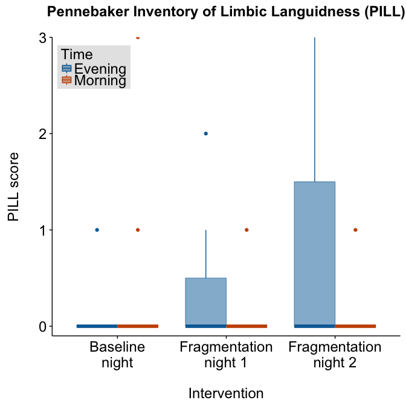

Other effects of sleep fragmentation
====================================

### Authors: Stella Iacovides & Peter Kamerman

**Date: December 11, 2015**

------------------------------------------------------------------------

Load required packages and set chunk options
--------------------------------------------

``` r
# Load packages
library(ggplot2)
library(scales)
library(grid)
library(cowplot)
library(knitr)
library(PMCMR) # pairwise post-hoc for Friedman test
library(readr)
library(dplyr)
library(tidyr)

# Load palette
cb8.categorical <- c("#0072B2", "#D55E00", "#666666")

# set seed
set.seed(123)

# knitr chunk options
opts_chunk$set(echo = FALSE,
               warning = FALSE,
               message = FALSE,
               fig.path = './figures/',
               fig.width = 7,
               fig.height = 7,
               dev = c('png', 'pdf'),
               tidy = TRUE, 
               tidy.opts = list(width.cutoff = 65))
```

Load data
---------

``` r
data <- read_csv("./data/other.csv", col_names = T)
```

### Quick look

    ## Observations: 33
    ## Variables: 11
    ## $ id                (chr) "A", "B", "C", "D", "E", "F", "G", "H", "I",...
    ## $ period            (chr) "baseline", "baseline", "baseline", "baselin...
    ## $ vF.before_mN      (int) 16, 16, 8, 8, 8, 8, 16, 16, 8, 8, 16, 16, 16...
    ## $ vf.during_mN      (int) 32, 64, 32, 32, 32, 32, 64, 32, 64, 32, 32, ...
    ## $ pin.prick_mN      (int) 256, 128, 128, 256, 128, 128, 512, 256, 128,...
    ## $ poms.evening      (int) 91, 85, 79, 97, 92, 89, 81, 94, 83, 81, 89, ...
    ## $ poms.morning      (int) 85, 83, 82, 95, 97, 87, 83, 98, 89, 89, 92, ...
    ## $ pill.evening      (int) 0, 0, 0, 1, 0, 0, 0, 0, 0, 0, 0, 0, 0, 0, 2,...
    ## $ pill.morning      (int) 0, 0, 0, 3, 0, 0, 0, 0, 0, 1, 0, 0, 0, 0, 1,...
    ## $ sleep.quality     (int) 95, 84, 78, 46, 84, 79, 78, 83, 84, 83, 86, ...
    ## $ morning.vigilance (int) 95, 71, 73, 60, 79, 76, 69, 77, 84, 80, 82, ...

    ##       id               period           vF.before_mN    vf.during_mN  
    ##  Length:33          Length:33          Min.   : 8.00   Min.   :32.00  
    ##  Class :character   Class :character   1st Qu.: 8.00   1st Qu.:32.00  
    ##  Mode  :character   Mode  :character   Median : 8.00   Median :64.00  
    ##                                        Mean   :11.64   Mean   :48.48  
    ##                                        3rd Qu.:16.00   3rd Qu.:64.00  
    ##                                        Max.   :16.00   Max.   :64.00  
    ##   pin.prick_mN    poms.evening     poms.morning    pill.evening   
    ##  Min.   : 64.0   Min.   : 79.00   Min.   : 82.0   Min.   :0.0000  
    ##  1st Qu.: 64.0   1st Qu.: 87.00   1st Qu.: 92.0   1st Qu.:0.0000  
    ##  Median :128.0   Median : 93.00   Median : 98.0   Median :0.0000  
    ##  Mean   :145.5   Mean   : 92.18   Mean   :100.4   Mean   :0.4242  
    ##  3rd Qu.:128.0   3rd Qu.: 97.00   3rd Qu.:111.0   3rd Qu.:0.0000  
    ##  Max.   :512.0   Max.   :107.00   Max.   :121.0   Max.   :3.0000  
    ##   pill.morning    sleep.quality   morning.vigilance
    ##  Min.   :0.0000   Min.   :14.00   Min.   : 9.00    
    ##  1st Qu.:0.0000   1st Qu.:42.00   1st Qu.:36.00    
    ##  Median :0.0000   Median :52.00   Median :52.00    
    ##  Mean   :0.1818   Mean   :56.15   Mean   :51.91    
    ##  3rd Qu.:0.0000   3rd Qu.:78.00   3rd Qu.:71.00    
    ##  Max.   :3.0000   Max.   :95.00   Max.   :95.00

### Process data

Data analysis
-------------

### Sleep quality


    ## 
    ##  Friedman rank sum test
    ## 
    ## data:  sleep.quality and period and id
    ## Friedman chi-squared = 16.909, df = 2, p-value = 0.0002129

    ## 
    ##  Pairwise comparisons using Conover's multiple comparison test   
    ##                     for unreplicated blocked data 
    ## 
    ## data:  sleep.quality and period and id 
    ## 
    ##                baseline fragmentation1
    ## fragmentation1 4.8e-08  -             
    ## fragmentation2 3.5e-09  0.092         
    ## 
    ## P value adjustment method: holm

### Morning vigilance


    ## 
    ##  Friedman rank sum test
    ## 
    ## data:  morning.vigilance and period and id
    ## Friedman chi-squared = 17.636, df = 2, p-value = 0.000148

    ## 
    ##  Pairwise comparisons using Conover's multiple comparison test   
    ##                     for unreplicated blocked data 
    ## 
    ## data:  morning.vigilance and period and id 
    ## 
    ##                baseline fragmentation1
    ## fragmentation1 9.2e-08  -             
    ## fragmentation2 8.4e-10  0.0066        
    ## 
    ## P value adjustment method: holm

### Pin-prick


    ## 
    ##  Friedman rank sum test
    ## 
    ## data:  pin.prick_mN and period and id
    ## Friedman chi-squared = 17.706, df = 2, p-value = 0.000143

    ## 
    ##  Pairwise comparisons using Conover's multiple comparison test   
    ##                     for unreplicated blocked data 
    ## 
    ## data:  pin.prick_mN and period and id 
    ## 
    ##                baseline fragmentation1
    ## fragmentation1 0.0011   -             
    ## fragmentation2 5.8e-10  2.5e-07       
    ## 
    ## P value adjustment method: holm

### Profile of Mood States


    ## 
    ##  Friedman rank sum test
    ## 
    ## data:  poms.morning and period and id
    ## Friedman chi-squared = 22, df = 2, p-value = 1.67e-05

    ## 
    ##  Pairwise comparisons using Conover's multiple comparison test   
    ##                     for unreplicated blocked data 
    ## 
    ## data:  poms.morning and period and id 
    ## 
    ##                baseline fragmentation1
    ## fragmentation1 1.3e-07  -             
    ## fragmentation2 1.1e-12  1.3e-07       
    ## 
    ## P value adjustment method: holm

    ## 
    ##  Friedman rank sum test
    ## 
    ## data:  poms.evening and period and id
    ## Friedman chi-squared = 15.273, df = 2, p-value = 0.0004826

    ## 
    ##  Pairwise comparisons using Conover's multiple comparison test   
    ##                     for unreplicated blocked data 
    ## 
    ## data:  poms.evening and period and id 
    ## 
    ##                baseline fragmentation1
    ## fragmentation1 0.0033   -             
    ## fragmentation2 9.5e-09  3.4e-06       
    ## 
    ## P value adjustment method: holm

### Pennebaker inventory of Limbic Languidness (PILL)



    ## 
    ##  Friedman rank sum test
    ## 
    ## data:  pill.morning and period and id
    ## Friedman chi-squared = 1.4, df = 2, p-value = 0.4966

    ## 
    ##  Friedman rank sum test
    ## 
    ## data:  pill.evening and period and id
    ## Friedman chi-squared = 4, df = 2, p-value = 0.1353

### von Frey


    ## 
    ##  Friedman rank sum test
    ## 
    ## data:  vF.before_mN and period and id
    ## Friedman chi-squared = NaN, df = 2, p-value = NA

Session information
-------------------

    ## R version 3.2.2 (2015-08-14)
    ## Platform: x86_64-apple-darwin13.4.0 (64-bit)
    ## Running under: OS X 10.11.1 (El Capitan)
    ## 
    ## locale:
    ## [1] C
    ## 
    ## attached base packages:
    ## [1] grid      stats     graphics  grDevices utils     datasets  methods  
    ## [8] base     
    ## 
    ## other attached packages:
    ## [1] tidyr_0.3.1   dplyr_0.4.3   readr_0.2.2   PMCMR_3.0     knitr_1.11   
    ## [6] cowplot_0.5.0 scales_0.3.0  ggplot2_1.0.1
    ## 
    ## loaded via a namespace (and not attached):
    ##  [1] Rcpp_0.12.2      magrittr_1.5     MASS_7.3-45      munsell_0.4.2   
    ##  [5] colorspace_1.2-6 R6_2.1.1         stringr_1.0.0    plyr_1.8.3      
    ##  [9] tools_3.2.2      parallel_3.2.2   gtable_0.1.2     DBI_0.3.1       
    ## [13] htmltools_0.2.6  lazyeval_0.1.10  assertthat_0.1   yaml_2.1.13     
    ## [17] digest_0.6.8     reshape2_1.4.1   formatR_1.2.1    evaluate_0.8    
    ## [21] rmarkdown_0.8.1  labeling_0.3     stringi_1.0-1    proto_0.3-10
