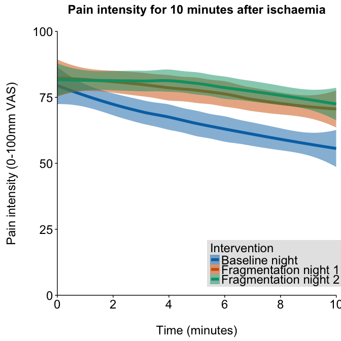
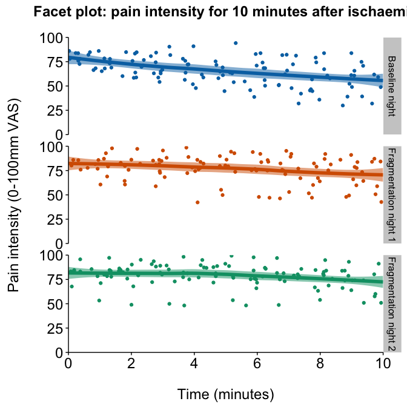

Regression
==========

### Authors: Stella Iacovides & Peter Kamerman

**Date: January 20, 2016**

------------------------------------------------------------------------

Load required packages and set chunk options
--------------------------------------------

``` r
# Load packages
library(ggplot2)
library(scales)
library(grid)
library(cowplot)
library(PMCMR) # pairwise Friedman posthoc tests
library(metafor) # arcsine transform
library(nlme) # mixed effect 'lme'
library(gamlss) # GAM using beta distribution
library(knitr)
library(pander)
library(readr)
library(dplyr)
library(tidyr)
library(boot)

# Load palette
cb8.categorical <- c("#0072B2", "#D55E00", "#009E73", "#F0E442", "#56B4E9", "#E69F00", "#CC79A7", "#999999")

# set seed
set.seed(123)

# knitr chunk options
opts_chunk$set(echo = FALSE,
               warning = FALSE,
               message = FALSE,
               fig.path = './figures/',
               fig.width = 7,
               fig.height = 7,
               dev = c('png', 'pdf'),
               tidy = TRUE, 
               tidy.opts = list(width.cutoff = 65))
```

Load data
---------

``` r
data <- read_csv("./data/regression.csv", col_names = T)
```

Quick look
----------

    ## Observations: 33
    ## Variables: 13
    ## $ id     (chr) "A", "B", "C", "D", "E", "F", "G", "H", "I", "J", "K", ...
    ## $ period (chr) "baseline", "baseline", "baseline", "baseline", "baseli...
    ## $ 0      (int) 88, 84, 73, 84, 73, 79, 86, 76, 78, 84, 78, 100, 76, 54...
    ## $ 1      (int) 86, 78, 65, 85, 78, 66, 82, 68, 69, 73, 68, 100, 93, 61...
    ## $ 2      (int) 83, 77, 64, 85, 76, 58, 85, 60, 71, 70, 59, 100, 81, 64...
    ## $ 3      (int) 82, 81, 67, 90, 74, 59, 84, 63, 65, 63, 54, 85, 73, 68,...
    ## $ 4      (int) 64, 76, 72, 91, 72, 59, 78, 52, 62, 56, 48, 74, 78, 72,...
    ## $ 5      (int) 58, 72, 63, 94, 69, 64, 75, 61, 65, 54, 45, 50, 86, 74,...
    ## $ 6      (int) 50, 68, 56, 83, 68, 84, 74, 55, 71, 46, 39, 48, 86, 75,...
    ## $ 7      (int) 48, 62, 51, 82, 72, 82, 81, 51, 66, 42, 32, 46, 89, 76,...
    ## $ 8      (int) 58, 57, 47, 84, 74, 67, 79, 45, 61, 45, 36, 47, 64, 82,...
    ## $ 9      (int) 49, 61, 39, 84, 71, 61, 75, 39, 66, 52, 30, 48, 64, 84,...
    ## $ 10     (int) 38, 59, 32, 79, 73, 62, 74, 36, 84, 49, 27, 43, 73, 84,...

    ##       id               period                0                1         
    ##  Length:33          Length:33          Min.   : 54.00   Min.   : 53.00  
    ##  Class :character   Class :character   1st Qu.: 76.00   1st Qu.: 71.00  
    ##  Mode  :character   Mode  :character   Median : 83.00   Median : 78.00  
    ##                                        Mean   : 81.45   Mean   : 79.33  
    ##                                        3rd Qu.: 86.00   3rd Qu.: 86.00  
    ##                                        Max.   :100.00   Max.   :100.00  
    ##        2                3               4               5     
    ##  Min.   : 49.00   Min.   :50.00   Min.   :42.00   Min.   :45  
    ##  1st Qu.: 70.00   1st Qu.:68.00   1st Qu.:72.00   1st Qu.:64  
    ##  Median : 80.00   Median :81.00   Median :77.00   Median :78  
    ##  Mean   : 77.48   Mean   :77.33   Mean   :75.36   Mean   :75  
    ##  3rd Qu.: 85.00   3rd Qu.:86.00   3rd Qu.:86.00   3rd Qu.:88  
    ##  Max.   :100.00   Max.   :96.00   Max.   :99.00   Max.   :99  
    ##        6            7               8               9        
    ##  Min.   :39   Min.   :32.00   Min.   :36.00   Min.   :30.00  
    ##  1st Qu.:66   1st Qu.:62.00   1st Qu.:58.00   1st Qu.:60.00  
    ##  Median :75   Median :76.00   Median :69.00   Median :71.00  
    ##  Mean   :72   Mean   :71.15   Mean   :68.94   Mean   :67.33  
    ##  3rd Qu.:84   3rd Qu.:82.00   3rd Qu.:81.00   3rd Qu.:79.00  
    ##  Max.   :98   Max.   :97.00   Max.   :95.00   Max.   :93.00  
    ##        10       
    ##  Min.   :27.00  
    ##  1st Qu.:58.00  
    ##  Median :73.00  
    ##  Mean   :66.42  
    ##  3rd Qu.:82.00  
    ##  Max.   :91.00

Process data
------------

Data analysis
-------------

### Plot the data





Regression analysis
-------------------

### Raw VAS scores


    ## 
    ## Family:  c("NO", "Normal") 
    ## Fitting method: "nlminb" 
    ## 
    ## Call:  gamlssML(y = y, family = "NO", formula = ischaemia_analysis$score) 
    ## 
    ## 
    ## Mu Coefficients:
    ## [1]  0.738
    ## Sigma Coefficients:
    ## [1]  -1.908
    ## 
    ##  Degrees of Freedom for the fit: 2 Residual Deg. of Freedom   361 
    ## Global Deviance:     -355.091 
    ##             AIC:     -351.091 
    ##             SBC:     -343.303

    ## Linear mixed-effects model fit by maximum likelihood
    ##  Data: ischaemia_analysis 
    ##         AIC       BIC   logLik
    ##   -465.6643 -446.1923 237.8322
    ## 
    ## Random effects:
    ##  Formula: ~time | id
    ##  Structure: General positive-definite, Log-Cholesky parametrization
    ##             StdDev     Corr  
    ## (Intercept) 0.09780450 (Intr)
    ## time        0.01808541 -0.703
    ## Residual    0.11696606       
    ## 
    ## Fixed effects: score ~ 1 
    ##                 Value  Std.Error  DF  t-value p-value
    ## (Intercept) 0.7539546 0.02200581 352 34.26162       0
    ## 
    ## Standardized Within-Group Residuals:
    ##         Min          Q1         Med          Q3         Max 
    ## -3.20284214 -0.62337225  0.09623895  0.63467053  3.03930741 
    ## 
    ## Number of Observations: 363
    ## Number of Groups: 11

    ## Linear mixed-effects model fit by maximum likelihood
    ##  Data: ischaemia_analysis 
    ##        AIC       BIC  logLik
    ##   -473.936 -450.5696 242.968
    ## 
    ## Random effects:
    ##  Formula: ~time | id
    ##  Structure: General positive-definite, Log-Cholesky parametrization
    ##             StdDev     Corr  
    ## (Intercept) 0.07812532 (Intr)
    ## time        0.01016857 -0.457
    ## Residual    0.11696613       
    ## 
    ## Fixed effects: score ~ time 
    ##                  Value   Std.Error  DF   t-value p-value
    ## (Intercept)  0.8127961 0.026278996 351 30.929497       0
    ## time        -0.0149559 0.003638932 351 -4.109976       0
    ##  Correlation: 
    ##      (Intr)
    ## time -0.545
    ## 
    ## Standardized Within-Group Residuals:
    ##         Min          Q1         Med          Q3         Max 
    ## -3.02527225 -0.61149726  0.08147055  0.65865709  2.89060855 
    ## 
    ## Number of Observations: 363
    ## Number of Groups: 11

    ## Linear mixed-effects model fit by maximum likelihood
    ##  Data: ischaemia_analysis 
    ##         AIC       BIC   logLik
    ##   -565.8279 -534.6727 290.9139
    ## 
    ## Random effects:
    ##  Formula: ~time | id
    ##  Structure: General positive-definite, Log-Cholesky parametrization
    ##             StdDev     Corr  
    ## (Intercept) 0.08036948 (Intr)
    ## time        0.01065656 -0.483
    ## Residual    0.10162407       
    ## 
    ## Fixed effects: score ~ time + period 
    ##                           Value   Std.Error  DF   t-value p-value
    ## (Intercept)           0.7340358 0.027422026 349 26.768110   0e+00
    ## time                 -0.0149559 0.003649054 349 -4.098575   1e-04
    ## periodfragmentation1  0.1095868 0.013137871 349  8.341289   0e+00
    ## periodfragmentation2  0.1266942 0.013137871 349  9.643436   0e+00
    ##  Correlation: 
    ##                      (Intr) time   prdfr1
    ## time                 -0.524              
    ## periodfragmentation1 -0.240  0.000       
    ## periodfragmentation2 -0.240  0.000  0.500
    ## 
    ## Standardized Within-Group Residuals:
    ##         Min          Q1         Med          Q3         Max 
    ## -2.75103879 -0.59499561  0.09466289  0.58268492  3.30690287 
    ## 
    ## Number of Observations: 363
    ## Number of Groups: 11

    ##            Model df       AIC       BIC   logLik   Test L.Ratio p-value
    ## mod1.null      1  5 -465.6643 -446.1923 237.8322                       
    ## mod1.basic     2  6 -473.9360 -450.5696 242.9680 1 vs 2 10.2717  0.0014

    ##           Model df       AIC       BIC   logLik   Test  L.Ratio p-value
    ## mod1.null     1  5 -465.6643 -446.1923 237.8322                        
    ## mod1.full     2  8 -565.8279 -534.6727 290.9139 1 vs 2 106.1636  <.0001

    ##            Model df       AIC       BIC   logLik   Test  L.Ratio p-value
    ## mod1.basic     1  6 -473.9360 -450.5696 242.9680                        
    ## mod1.full      2  8 -565.8279 -534.6727 290.9139 1 vs 2 95.89187  <.0001

  

    ## 
    ## Family:  c("NO", "Normal") 
    ## Fitting method: "nlminb" 
    ## 
    ## Call:  gamlssML(y = y, family = "NO", formula = residuals(mod1.full)) 
    ## 
    ## Mu Coefficients:
    ## [1]  1.192e-07
    ## Sigma Coefficients:
    ## [1]  -2.313
    ## 
    ##  Degrees of Freedom for the fit: 2 Residual Deg. of Freedom   361 
    ## Global Deviance:     -649.243 
    ##             AIC:     -645.243 
    ##             SBC:     -637.454


### Arcsine transformed VAS scores


    ## 
    ## Family:  c("NO", "Normal") 
    ## Fitting method: "nlminb" 
    ## 
    ## Call:  
    ## gamlssML(y = y, family = "NO", formula = ischaemia_analysis$score.arcsine) 
    ## 
    ## 
    ## Mu Coefficients:
    ## [1]  1.052
    ## Sigma Coefficients:
    ## [1]  -1.71
    ## 
    ##  Degrees of Freedom for the fit: 2 Residual Deg. of Freedom   361 
    ## Global Deviance:     -210.97 
    ##             AIC:     -206.97 
    ##             SBC:     -199.181

    ## Linear mixed-effects model fit by maximum likelihood
    ##  Data: ischaemia_analysis 
    ##         AIC       BIC   logLik
    ##   -339.1776 -319.7056 174.5888
    ## 
    ## Random effects:
    ##  Formula: ~time | id
    ##  Structure: General positive-definite, Log-Cholesky parametrization
    ##             StdDev     Corr  
    ## (Intercept) 0.15040880 (Intr)
    ## time        0.02339971 -0.802
    ## Residual    0.13858611       
    ## 
    ## Fixed effects: score.arcsine ~ 1 
    ##                Value  Std.Error  DF  t-value p-value
    ## (Intercept) 1.049094 0.02806141 352 37.38566       0
    ## 
    ## Standardized Within-Group Residuals:
    ##         Min          Q1         Med          Q3         Max 
    ## -2.88150128 -0.63641437  0.01283535  0.64085360  3.15456045 
    ## 
    ## Number of Observations: 363
    ## Number of Groups: 11

    ## Linear mixed-effects model fit by maximum likelihood
    ##  Data: ischaemia_analysis 
    ##         AIC       BIC   logLik
    ##   -345.9381 -322.5717 178.9691
    ## 
    ## Random effects:
    ##  Formula: ~time | id
    ##  Structure: General positive-definite, Log-Cholesky parametrization
    ##             StdDev     Corr  
    ## (Intercept) 0.11758438 (Intr)
    ## time        0.01466148 -0.646
    ## Residual    0.13858611       
    ## 
    ## Fixed effects: score.arcsine ~ time 
    ##                 Value  Std.Error  DF   t-value p-value
    ## (Intercept)  1.142885 0.03808004 351 30.012719   0e+00
    ## time        -0.018237 0.00499702 351 -3.649569   3e-04
    ##  Correlation: 
    ##      (Intr)
    ## time -0.675
    ## 
    ## Standardized Within-Group Residuals:
    ##        Min         Q1        Med         Q3        Max 
    ## -2.7382101 -0.6241874  0.0203817  0.6350496  3.0297538 
    ## 
    ## Number of Observations: 363
    ## Number of Groups: 11

    ## Linear mixed-effects model fit by maximum likelihood
    ##  Data: ischaemia_analysis 
    ##         AIC       BIC   logLik
    ##   -443.0052 -411.8499 229.5026
    ## 
    ## Random effects:
    ##  Formula: ~time | id
    ##  Structure: General positive-definite, Log-Cholesky parametrization
    ##             StdDev     Corr  
    ## (Intercept) 0.11978555 (Intr)
    ## time        0.01516203 -0.654
    ## Residual    0.11949801       
    ## 
    ## Fixed effects: score.arcsine ~ time + period 
    ##                           Value  Std.Error  DF   t-value p-value
    ## (Intercept)           1.0471393 0.03921378 349 26.703347   0e+00
    ## time                 -0.0182370 0.00501092 349 -3.639445   3e-04
    ## periodfragmentation1  0.1354859 0.01544860 349  8.770111   0e+00
    ## periodfragmentation2  0.1517527 0.01544860 349  9.823072   0e+00
    ##  Correlation: 
    ##                      (Intr) time   prdfr1
    ## time                 -0.657              
    ## periodfragmentation1 -0.197  0.000       
    ## periodfragmentation2 -0.197  0.000  0.500
    ## 
    ## Standardized Within-Group Residuals:
    ##           Min            Q1           Med            Q3           Max 
    ## -2.6621184751 -0.6590838295 -0.0005050999  0.5797644617  3.2055402346 
    ## 
    ## Number of Observations: 363
    ## Number of Groups: 11

    ##            Model df       AIC       BIC   logLik   Test  L.Ratio p-value
    ## mod2.null      1  5 -339.1776 -319.7056 174.5888                        
    ## mod2.basic     2  6 -345.9381 -322.5717 178.9691 1 vs 2 8.760476  0.0031

    ##           Model df       AIC       BIC   logLik   Test  L.Ratio p-value
    ## mod2.null     1  5 -339.1776 -319.7056 174.5888                        
    ## mod2.full     2  8 -443.0052 -411.8499 229.5026 1 vs 2 109.8275  <.0001

    ##            Model df       AIC       BIC   logLik   Test L.Ratio p-value
    ## mod2.basic     1  6 -345.9381 -322.5717 178.9691                       
    ## mod2.full      2  8 -443.0052 -411.8499 229.5026 1 vs 2 101.067  <.0001

  

    ## 
    ## Family:  c("NO", "Normal") 
    ## Fitting method: "nlminb" 
    ## 
    ## Call:  gamlssML(y = y, family = "NO", formula = residuals(mod2.full)) 
    ## 
    ## Mu Coefficients:
    ## [1]  4.838e-08
    ## Sigma Coefficients:
    ## [1]  -2.152
    ## 
    ##  Degrees of Freedom for the fit: 2 Residual Deg. of Freedom   361 
    ## Global Deviance:     -532.466 
    ##             AIC:     -528.466 
    ##             SBC:     -520.677


### GAM using raw VAS scores, with beta-regression link

    ## GAMLSS-RS iteration 1: Global Deviance = -484.9438 
    ## GAMLSS-RS iteration 2: Global Deviance = -563.5008 
    ## GAMLSS-RS iteration 3: Global Deviance = -566.4439 
    ## GAMLSS-RS iteration 4: Global Deviance = -566.5581 
    ## GAMLSS-RS iteration 5: Global Deviance = -566.5621 
    ## GAMLSS-RS iteration 6: Global Deviance = -566.5624

    ## *******************************************************************
    ## Family:  c("BEINF", "Beta Inflated") 
    ## 
    ## Call:  
    ## gamlss(formula = score ~ 1 + re(random = ~time | id), family = BEINF,  
    ##     data = ischaemia_analysis) 
    ## 
    ## Fitting method: RS() 
    ## 
    ## -------------------------------------------------------------------
    ## Mu link function:  logit
    ## Mu Coefficients:
    ##             Estimate Std. Error t value Pr(>|t|)    
    ## (Intercept)   1.0431     0.0311   33.54   <2e-16 ***
    ## ---
    ## Signif. codes:  0 '***' 0.001 '**' 0.01 '*' 0.05 '.' 0.1 ' ' 1
    ## 
    ## -------------------------------------------------------------------
    ## Sigma link function:  logit
    ## Sigma Coefficients:
    ##             Estimate Std. Error t value Pr(>|t|)    
    ## (Intercept) -1.05665    0.04559  -23.18   <2e-16 ***
    ## ---
    ## Signif. codes:  0 '***' 0.001 '**' 0.01 '*' 0.05 '.' 0.1 ' ' 1
    ## 
    ## -------------------------------------------------------------------
    ## Nu link function:  log 
    ## Nu Coefficients:
    ##             Estimate Std. Error t value Pr(>|t|)
    ## (Intercept)   -19.54     920.77  -0.021    0.983
    ## 
    ## -------------------------------------------------------------------
    ## Tau link function:  log 
    ## Tau Coefficients:
    ##             Estimate Std. Error t value Pr(>|t|)    
    ## (Intercept)  -4.4970     0.5028  -8.944   <2e-16 ***
    ## ---
    ## Signif. codes:  0 '***' 0.001 '**' 0.01 '*' 0.05 '.' 0.1 ' ' 1
    ## 
    ## -------------------------------------------------------------------
    ## NOTE: Additive smoothing terms exist in the formulas: 
    ##  i) Std. Error for smoothers are for the linear effect only. 
    ## ii) Std. Error for the linear terms maybe are not accurate. 
    ## -------------------------------------------------------------------
    ## No. of observations in the fit:  363 
    ## Degrees of Freedom for the fit:  23.76029
    ##       Residual Deg. of Freedom:  339.2397 
    ##                       at cycle:  6 
    ##  
    ## Global Deviance:     -566.5624 
    ##             AIC:     -519.0418 
    ##             SBC:     -426.5097 
    ## *******************************************************************

    ## GAMLSS-RS iteration 1: Global Deviance = -483.7969 
    ## GAMLSS-RS iteration 2: Global Deviance = -560.9467 
    ## GAMLSS-RS iteration 3: Global Deviance = -563.586 
    ## GAMLSS-RS iteration 4: Global Deviance = -563.6756 
    ## GAMLSS-RS iteration 5: Global Deviance = -563.6768 
    ## GAMLSS-RS iteration 6: Global Deviance = -563.6772

    ## *******************************************************************
    ## Family:  c("BEINF", "Beta Inflated") 
    ## 
    ## Call:  
    ## gamlss(formula = score ~ time + re(random = ~time | id), family = BEINF,  
    ##     data = ischaemia_analysis) 
    ## 
    ## Fitting method: RS() 
    ## 
    ## -------------------------------------------------------------------
    ## Mu link function:  logit
    ## Mu Coefficients:
    ##              Estimate Std. Error t value Pr(>|t|)    
    ## (Intercept)  1.399281   0.060775  23.024  < 2e-16 ***
    ## time        -0.069628   0.009803  -7.103 7.16e-12 ***
    ## ---
    ## Signif. codes:  0 '***' 0.001 '**' 0.01 '*' 0.05 '.' 0.1 ' ' 1
    ## 
    ## -------------------------------------------------------------------
    ## Sigma link function:  logit
    ## Sigma Coefficients:
    ##             Estimate Std. Error t value Pr(>|t|)    
    ## (Intercept) -1.05291    0.04568  -23.05   <2e-16 ***
    ## ---
    ## Signif. codes:  0 '***' 0.001 '**' 0.01 '*' 0.05 '.' 0.1 ' ' 1
    ## 
    ## -------------------------------------------------------------------
    ## Nu link function:  log 
    ## Nu Coefficients:
    ##             Estimate Std. Error t value Pr(>|t|)
    ## (Intercept)   -19.54     920.77  -0.021    0.983
    ## 
    ## -------------------------------------------------------------------
    ## Tau link function:  log 
    ## Tau Coefficients:
    ##             Estimate Std. Error t value Pr(>|t|)    
    ## (Intercept)  -4.4970     0.5028  -8.944   <2e-16 ***
    ## ---
    ## Signif. codes:  0 '***' 0.001 '**' 0.01 '*' 0.05 '.' 0.1 ' ' 1
    ## 
    ## -------------------------------------------------------------------
    ## NOTE: Additive smoothing terms exist in the formulas: 
    ##  i) Std. Error for smoothers are for the linear effect only. 
    ## ii) Std. Error for the linear terms maybe are not accurate. 
    ## -------------------------------------------------------------------
    ## No. of observations in the fit:  363 
    ## Degrees of Freedom for the fit:  21.91761
    ##       Residual Deg. of Freedom:  341.0824 
    ##                       at cycle:  6 
    ##  
    ## Global Deviance:     -563.6772 
    ##             AIC:     -519.842 
    ##             SBC:     -434.486 
    ## *******************************************************************

    ## GAMLSS-RS iteration 1: Global Deviance = -543.4586 
    ## GAMLSS-RS iteration 2: Global Deviance = -655.4316 
    ## GAMLSS-RS iteration 3: Global Deviance = -659.1856 
    ## GAMLSS-RS iteration 4: Global Deviance = -659.2752 
    ## GAMLSS-RS iteration 5: Global Deviance = -659.2693 
    ## GAMLSS-RS iteration 6: Global Deviance = -659.2694

    ## *******************************************************************
    ## Family:  c("BEINF", "Beta Inflated") 
    ## 
    ## Call:  gamlss(formula = score ~ time + period + re(random = ~time |  
    ##     id), family = BEINF, data = ischaemia_analysis) 
    ## 
    ## Fitting method: RS() 
    ## 
    ## -------------------------------------------------------------------
    ## Mu link function:  logit
    ## Mu Coefficients:
    ##                       Estimate Std. Error t value Pr(>|t|)    
    ## (Intercept)           1.048628   0.063318  16.561  < 2e-16 ***
    ## time                 -0.074224   0.008779  -8.455 8.51e-16 ***
    ## periodfragmentation1  0.531394   0.065756   8.081 1.15e-14 ***
    ## periodfragmentation2  0.648925   0.066680   9.732  < 2e-16 ***
    ## ---
    ## Signif. codes:  0 '***' 0.001 '**' 0.01 '*' 0.05 '.' 0.1 ' ' 1
    ## 
    ## -------------------------------------------------------------------
    ## Sigma link function:  logit
    ## Sigma Coefficients:
    ##             Estimate Std. Error t value Pr(>|t|)    
    ## (Intercept) -1.22063    0.04485  -27.21   <2e-16 ***
    ## ---
    ## Signif. codes:  0 '***' 0.001 '**' 0.01 '*' 0.05 '.' 0.1 ' ' 1
    ## 
    ## -------------------------------------------------------------------
    ## Nu link function:  log 
    ## Nu Coefficients:
    ##             Estimate Std. Error t value Pr(>|t|)
    ## (Intercept)   -19.54     926.37  -0.021    0.983
    ## 
    ## -------------------------------------------------------------------
    ## Tau link function:  log 
    ## Tau Coefficients:
    ##             Estimate Std. Error t value Pr(>|t|)    
    ## (Intercept)  -4.4970     0.5028  -8.944   <2e-16 ***
    ## ---
    ## Signif. codes:  0 '***' 0.001 '**' 0.01 '*' 0.05 '.' 0.1 ' ' 1
    ## 
    ## -------------------------------------------------------------------
    ## NOTE: Additive smoothing terms exist in the formulas: 
    ##  i) Std. Error for smoothers are for the linear effect only. 
    ## ii) Std. Error for the linear terms maybe are not accurate. 
    ## -------------------------------------------------------------------
    ## No. of observations in the fit:  363 
    ## Degrees of Freedom for the fit:  25.02059
    ##       Residual Deg. of Freedom:  337.9794 
    ##                       at cycle:  6 
    ##  
    ## Global Deviance:     -659.2694 
    ##             AIC:     -609.2282 
    ##             SBC:     -511.7879 
    ## *******************************************************************

    ## GAMLSS-RS iteration 1: Global Deviance = -543.4586 
    ## GAMLSS-RS iteration 2: Global Deviance = -655.4316 
    ## GAMLSS-RS iteration 3: Global Deviance = -659.1856 
    ## GAMLSS-RS iteration 4: Global Deviance = -659.2752 
    ## GAMLSS-RS iteration 5: Global Deviance = -659.2693 
    ## GAMLSS-RS iteration 6: Global Deviance = -659.2694

    ## *******************************************************************
    ## Family:  c("BEINF", "Beta Inflated") 
    ## 
    ## Call:  gamlss(formula = score ~ time + period + re(random = ~time |  
    ##     id), family = BEINF, data = ischaemia.analysis_frag2ref) 
    ## 
    ## Fitting method: RS() 
    ## 
    ## -------------------------------------------------------------------
    ## Mu link function:  logit
    ## Mu Coefficients:
    ##                       Estimate Std. Error t value Pr(>|t|)    
    ## (Intercept)           1.697553   0.069513  24.421  < 2e-16 ***
    ## time                 -0.074224   0.008779  -8.455 8.51e-16 ***
    ## periodfragmentation1 -0.117530   0.069270  -1.697   0.0907 .  
    ## periodbaseline       -0.648925   0.066680  -9.732  < 2e-16 ***
    ## ---
    ## Signif. codes:  0 '***' 0.001 '**' 0.01 '*' 0.05 '.' 0.1 ' ' 1
    ## 
    ## -------------------------------------------------------------------
    ## Sigma link function:  logit
    ## Sigma Coefficients:
    ##             Estimate Std. Error t value Pr(>|t|)    
    ## (Intercept) -1.22063    0.04485  -27.21   <2e-16 ***
    ## ---
    ## Signif. codes:  0 '***' 0.001 '**' 0.01 '*' 0.05 '.' 0.1 ' ' 1
    ## 
    ## -------------------------------------------------------------------
    ## Nu link function:  log 
    ## Nu Coefficients:
    ##             Estimate Std. Error t value Pr(>|t|)
    ## (Intercept)   -19.54     920.77  -0.021    0.983
    ## 
    ## -------------------------------------------------------------------
    ## Tau link function:  log 
    ## Tau Coefficients:
    ##             Estimate Std. Error t value Pr(>|t|)    
    ## (Intercept)  -4.4970     0.5028  -8.944   <2e-16 ***
    ## ---
    ## Signif. codes:  0 '***' 0.001 '**' 0.01 '*' 0.05 '.' 0.1 ' ' 1
    ## 
    ## -------------------------------------------------------------------
    ## NOTE: Additive smoothing terms exist in the formulas: 
    ##  i) Std. Error for smoothers are for the linear effect only. 
    ## ii) Std. Error for the linear terms maybe are not accurate. 
    ## -------------------------------------------------------------------
    ## No. of observations in the fit:  363 
    ## Degrees of Freedom for the fit:  25.02059
    ##       Residual Deg. of Freedom:  337.9794 
    ##                       at cycle:  6 
    ##  
    ## Global Deviance:     -659.2694 
    ##             AIC:     -609.2282 
    ##             SBC:     -511.7879 
    ## *******************************************************************

    ##                          df       AIC
    ## mod3.full          25.02059 -609.2282
    ## mod3.full_frag2ref 25.02059 -609.2282
    ## mod3.basic         21.91761 -519.8420
    ## mod3.null          23.76029 -519.0418

    ##  Likelihood Ratio Test for nested GAMLSS models. 
    ##  (No check whether the models are nested is performed). 
    ##  
    ##        Null model: deviance= -563.6772 with  21.91761 deg. of freedom 
    ##  Altenative model: deviance= -566.5624 with  23.76029 deg. of freedom 
    ##  
    ##  LRT = 2.885247 with 1.842682 deg. of freedom and p-value= 0.2105444

    ##  Likelihood Ratio Test for nested GAMLSS models. 
    ##  (No check whether the models are nested is performed). 
    ##  
    ##        Null model: deviance= -566.5624 with  23.76029 deg. of freedom 
    ##  Altenative model: deviance= -659.2694 with  25.02059 deg. of freedom 
    ##  
    ##  LRT = 92.70694 with 1.2603 deg. of freedom and p-value= 0

    ##  Likelihood Ratio Test for nested GAMLSS models. 
    ##  (No check whether the models are nested is performed). 
    ##  
    ##        Null model: deviance= -563.6772 with  21.91761 deg. of freedom 
    ##  Altenative model: deviance= -659.2694 with  25.02059 deg. of freedom 
    ##  
    ##  LRT = 95.59219 with 3.102982 deg. of freedom and p-value= 0

  

    ## 
    ## Family:  c("NO", "Normal") 
    ## Fitting method: "nlminb" 
    ## 
    ## Call:  gamlssML(y = y, family = "NO", formula = residuals(mod3.full)) 
    ## 
    ## Mu Coefficients:
    ## [1]  0.0135
    ## Sigma Coefficients:
    ## [1]  -0.01614
    ## 
    ##  Degrees of Freedom for the fit: 2 Residual Deg. of Freedom   361 
    ## Global Deviance:     1018.44 
    ##             AIC:     1022.44 
    ##             SBC:     1030.22


Effect size
-----------

    ## # Baseline night
    ## 
    ## Bootstrap mean (95% CI) change in pain intensity (0-100mm VAS) over a ten-minute period following removal of a torniquet: 25mm (13 to 36)


    ## # One night of sleep fragmentation
    ## 
    ## Bootstrap mean (95% CI) change in pain intensity (0-100mm VAS) over a ten-minute period following removal of a torniquet: 10mm (-2 to 23)


    ## # Two nights of sleep fragmentation
    ## 
    ## Bootstrap mean (95% CI) change in pain intensity (0-100mm VAS) over a ten-minute period following removal of a torniquet: 10mm (4 to 17)


Session information
-------------------

    ## R version 3.2.3 (2015-12-10)
    ## Platform: x86_64-apple-darwin13.4.0 (64-bit)
    ## Running under: OS X 10.11.2 (El Capitan)
    ## 
    ## locale:
    ## [1] C
    ## 
    ## attached base packages:
    ##  [1] parallel  splines   grid      stats     graphics  grDevices utils    
    ##  [8] datasets  methods   base     
    ## 
    ## other attached packages:
    ##  [1] boot_1.3-17       tidyr_0.3.1       dplyr_0.4.3      
    ##  [4] readr_0.2.2       pander_0.6.0      knitr_1.11       
    ##  [7] gamlss_4.3-6      gamlss.dist_4.3-5 MASS_7.3-45      
    ## [10] gamlss.data_4.3-0 nlme_3.1-122      metafor_1.9-8    
    ## [13] Matrix_1.2-3      PMCMR_4.0         cowplot_0.6.0    
    ## [16] scales_0.3.0      ggplot2_2.0.0    
    ## 
    ## loaded via a namespace (and not attached):
    ##  [1] Rcpp_0.12.2      formatR_1.2.1    plyr_1.8.3       tools_3.2.3     
    ##  [5] digest_0.6.8     evaluate_0.8     gtable_0.1.2     lattice_0.20-33 
    ##  [9] DBI_0.3.1        yaml_2.1.13      stringr_1.0.0    R6_2.1.1        
    ## [13] survival_2.38-3  rmarkdown_0.9.2  reshape2_1.4.1   magrittr_1.5    
    ## [17] htmltools_0.3    assertthat_0.1   colorspace_1.2-6 labeling_0.3    
    ## [21] stringi_1.0-1    lazyeval_0.1.10  munsell_0.4.2
